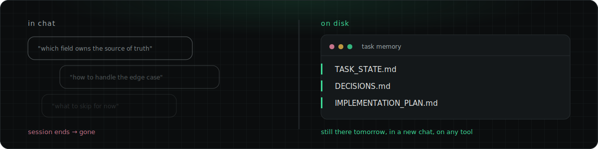
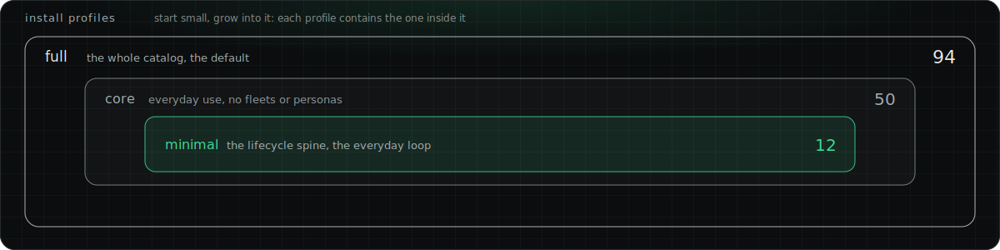
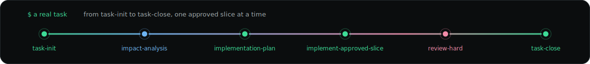
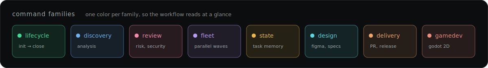

<p align="center">
  
</p>

<p align="center">
  <a href="LICENSE"></a>
  &nbsp;
  <a href="#status-license-and-contributing"></a>
</p>

> A workflow operating system for AI-assisted engineering. Task state, decisions, and plans live on disk as files, not in chat history, so context survives across sessions, tools, and restarts.

You start an AI coding session on a real feature. Twenty minutes in, you've made three decisions in chat: which field owns the source of truth, how to handle the edge case, what to skip for now. None of that gets written anywhere. You close the laptop. Tomorrow, or in a new chat, the agent has no memory of any of it. You re-explain the feature, re-litigate a decision you already made, and it starts editing files before you agreed on the approach.

Fhorja's answer: task state, decisions, and plans live in markdown files on disk, not in chat history. Open a new session, and `resume-from-state` reads `TASK_STATE.md` and tells you where you left off. A decision gets recorded once, in `DECISIONS.md`, with its reasoning, and every later step reads from it instead of guessing again. Before any code gets written, `implementation-plan` breaks the work into small slices (the smallest reviewable unit of change, each with its own scope and exit criteria) and `approve-plan` is the explicit human gate, so the agent never runs ahead of what you agreed to.

<p align="center">
  
</p>

## What it is

Fhorja is a workflow operating system for AI-assisted engineering: a markdown-plus-bash specification, not an application or a hosted service. It gives solo developers and small teams a disciplined, resumable process for AI-assisted work by keeping task state, decisions, and plans as files on disk instead of in chat history. It ships as <!-- count:commands -->94<!-- /count --> command files that share one output contract and chain into each other (discovery, decisions, planning, slice-by-slice execution, review, delivery), distributed to any editor as Agent Skills or legacy slash commands.

It targets engineers who already use an AI coding tool (Cursor, Claude Code, and 35+ others that read the open Agent Skills standard, per [`CONTRIBUTING.md`](./CONTRIBUTING.md)) and want plan-before-code discipline with an explicit human approval gate before implementation.

New here? [`WORKFLOW_DEMO.md`](./WORKFLOW_DEMO.md) is a full walkthrough with example prompts and outputs. [`docs/FAQ.md`](./docs/FAQ.md) answers what it is, which tools work, and how licensing works. You do not need to read [`WORKFLOW_OPERATING_SYSTEM.md`](./WORKFLOW_OPERATING_SYSTEM.md) first: it is the normative spec commands load sections from on demand, not a manual you read cover to cover. Run `task-init` (or `workflow-guide` if you want the explanation as you go) and let the handoffs carry you.

## Quickstart

Fhorja lives in its own repository, separate from any product codebase you work on. You clone it once, centrally, the same way you'd install a CLI tool, not once per project. The commands then reach whichever product repo you're working in, either automatically (open that repo in an editor that reads Agent Skills, once you've mirrored them with `--with-skills` below) or by installing straight into it with `--project`.

```bash
git clone https://github.com/Mozurok/fhorja.dev.git
cd fhorja.dev
./scripts/bootstrap-user-setup.sh          # once: seeds USER_MEMORY.md, runs a lint sanity check
./scripts/sync-workflow-slash-commands.sh  # installs the commands into Cursor and Claude Code
```

In any editor that reads `.claude/skills/` (Cursor 2.4+, Claude Code), the commands are available as Agent Skills with no install step at all. Start your first task by running `task-init` and following the handoff printed at the end of each command. New to the workflow itself, not just this repo? Run `workflow-guide` instead of `task-init` first: it explains which command and editor mode to use right now, why, and the next two or three steps, so you are not guessing your way through the first task. Already fluent in the phases and just want the fast answer? Run `what-next` at any point; it gives the same routing decision with none of the explanation. Feeling stuck or looping? Run `im-stuck` instead. All three are safe to run anytime and never change your task's state. If you only have a few minutes before your first task, skim ahead to [Task memory on disk](#task-memory-on-disk) and [Repository layout](#repository-layout) below; they answer where things live, which is usually the first real question, before the full command catalog.

### Install profiles

All commands install by default. Pass `--profile` to start with a smaller surface and grow into it:

```bash
./scripts/sync-workflow-slash-commands.sh --profile minimal  # the lifecycle spine
./scripts/sync-workflow-slash-commands.sh --profile core     # everyday use, no fleets or personas
./scripts/sync-workflow-slash-commands.sh --profile full     # the whole catalog (default)
```

<p align="center">
  
</p>

The three profiles nest: `minimal` (<!-- count:commands-minimal -->12<!-- /count --> commands) inside `core` (<!-- count:commands-core -->50<!-- /count --> commands) inside `full` (<!-- count:commands -->94<!-- /count --> commands, the default). The `minimal` spine covers the everyday loop: `task-init`, `impact-analysis`, `decision-interview`, `implementation-plan`, `approve-plan`, `implement-approved-slice`, `slice-closure`, `review-hard`, `pr-package`, `what-next`, `sync-task-state`, `task-close`. Profiles are declared in each command's `x-wos-profiles` frontmatter and enforced by lint.

Two more flags worth knowing: `--with-skills` mirrors the Agent Skills to your user-level directories so they follow you across every project, and `--project /path/to/your/repo` additionally installs into a specific product repo, alongside your user directories.

## The task loop

A task moves through a short, explicit chain. Each command persists its result to task memory and hands off to the next:

<p align="center">
  
</p>

```
[problem-framing] -> task-init -> impact-analysis -> implementation-plan -> approve-plan
                  -> implement-approved-slice -> slice-closure -> review-hard -> pr-package -> task-close
```

`problem-framing` is an optional step before any task folder exists: it questions whether the stated problem is the right one, writes a one-page `BRIEF.md` that `task-init` consumes, and routes to `task-init` (or to `what-next` if a task is already active). Small, unambiguous changes skip the middle: `task-init -> implementation-plan -> implement-approved-slice -> branch-commit`. The system recommends a path; you stay in control with an explicit approval before any code is written.

## Core concepts

- **Task memory on disk, not chat.** Each task is a folder of markdown files, kept out of version control. See [Task memory on disk](#task-memory-on-disk) below for the file list.
- **Commands are the interface.** One markdown file per workflow action, grouped into <!-- count:command-categories -->9<!-- /count --> lifecycle categories. [`commands/*.md`](./commands/) is the canonical source; the `.claude/skills/` Agent Skills are generated from it and never hand-edited.
- **Plan before code, in small slices.** Work is broken into the smallest reviewable slices, each planned, approved, then implemented with a minimal diff.
- **One output contract.** Every command ends the same way: an artifact-changes block, a short transcript, and a handoff naming the next command, editor mode (Ask, Plan, Agent, or Debug, whatever your tool calls its interaction modes), and work complexity, so steps chain without going silent.
- **Proposed by default.** Artifacts are proposed for your review before they are written, unless you are explicitly in an apply mode. A wrong plan is discarded by ignoring the response, not by reverting commits.
- **Operating modes and task shapes.** A minimal, strict, or teaching posture ([ADR-0008](./docs/adr/0008-operating-modes.md)) and a small set of recognized task shapes ([ADR-0009](./docs/adr/0009-task-shape-system.md)) let the same commands flex from a quick hotfix to a fully governed multi-slice build.
- **Capability routing, not model names.** Commands declare work complexity (LOW, MEDIUM, HIGH); they never hard-code a model.

## Command clusters

<!-- count:commands -->94<!-- /count --> commands, grouped here into 14 clusters for orientation (this grouping is editorial, not the formal <!-- count:command-categories -->9<!-- /count -->-category boundary used inside the spec):

<p align="center">
  
</p>

| Cluster | A few commands | What it does |
|---|---|---|
| Core task lifecycle | `task-init`, `implementation-plan`, `implement-approved-slice`, `pr-package`, `task-close` | The 12-command minimal-install-profile spine: the chain a task actually walks from creation to closure. |
| State, navigation, recovery | `resume-from-state`, `what-next`, `im-stuck`, `portfolio-review` | Resuming, reconciling drift, and routing to the next step, without advancing the plan itself. |
| Project initialization | `project-bootstrap`, `capture-references` | The zero-state entry: creates project-level memory before any task folder exists. |
| Discovery, scoping, design-time review | `code-locate`, `impact-analysis`, `decision-interview`, `api-contract-review`, `frontend-system-design`, `backend-system-design` | Locating code, sizing blast radius, and pre-implementation contract or architecture RFCs. |
| Design system (WOS-UI) | `design-bootstrap`, `component-spec`, `screen-spec`, `image-to-spec`, `foundation-audit` | Figma-grounded token bootstrapping, per-component and per-screen specs, and drift audits. |
| Database context | `db-context-supabase`, `db-context-postgres` | Read-only schema introspection persisted as `DB_CONTEXT.md`; never destructive SQL. |
| Contract and decision hardening | `resolve-contract-gaps`, `contract-signoff`, `direction-adjust` | Turning ambiguity, contradictions, or a mid-task correction into a canonical decision set. |
| Planning, validation, specialist review | `implementation-plan`, `test-strategy`, `rls-auth-boundary-auditor`, `migration-safety-steward`, `a11y-audit`, `performance-budget` | Slicing work and gating it with specialist reviewer personas. |
| Execution and closure | `implement-approved-slice`, `implement-fleet`, `review-hard`, `security-review`, `godot-runtime-verify`, `app-runtime-verify` | The official execution path plus proactive review, runtime-verification gates, and closure. |
| Delivery and communication | `pr-package`, `pr-feedback-ingest`, `post-review-pivot`, `team-update` | Packaging a real git diff into PR artifacts, or turning review feedback into a backlog. |
| Prompt tooling | `prompt-shape` | Shapes a copy-paste-ready prompt aligned to the intended editor mode. |
| Godot 2D-mobile game-dev cluster | `godot-scene-plan`, `godot-runtime-verify` | Scene planning and a press-play runtime gate, added on top of the general lifecycle. See [ADR-0069](./docs/adr/0069-godot-2d-mobile-cluster.md). |
| Autonomous delivery track | `autonomous-run`, `autonomous-board` | A dispatcher over an approved, waved plan, bounded by two human gates; it never auto-merges. See [ADR-0044](./docs/adr/0044-autonomous-delivery-track.md). |
| Fleet (orchestrator-workers) variants | `implement-fleet`, `task-init-fleet`, `external-research-fleet`, `screen-spec-fleet` | Parallelizes an existing single-agent command across independent slices, screens, or research angles once file scopes are disjoint (ADR-0038, ADR-0041). |

### Two clusters worth a closer look

Frontend (`frontend-system-design`, `graphql-contract-review`, `frontend-architecture-review`, plus a mobile surface on `performance-budget`) and Godot 2D-mobile (`godot-scene-plan`, `godot-runtime-verify`) are additive, capability-routed groups, not separate products. Both reuse the whole lifecycle and add only the steps it doesn't already cover, and both are recorded in their own ADRs: the frontend set from [ADR-0065](./docs/adr/0065-frontend-system-design-rfc-command.md) through [ADR-0068](./docs/adr/0068-mobile-performance-budget-surface.md), Godot in [ADR-0069](./docs/adr/0069-godot-2d-mobile-cluster.md). `godot-runtime-verify` runs the scene and reads the real captured debugger output as Layer-1 runtime evidence ([ADR-0048](./docs/adr/0048-deterministic-gate-evidence.md)) rather than a claimed-but-unshown result, the same evidence bar the rest of the workflow holds a passing deterministic gate to.

## Task memory on disk

Each task lives in a folder, and `projects/` is gitignored by design ([ADR-0007](./docs/adr/0007-project-level-memory.md)) so task memory never lands in the open-source history:

```text
projects/<client>__<project>/active/YYYY-MM-DD_<task-slug>/
  README.md               # human summary
  TASK_STATE.md           # authoritative operational memory; read this to resume
  SOURCE_OF_TRUTH.md      # canonical facts, including the path to the actual codebase this task changes
  DECISIONS.md            # locked decisions with reasoning
  IMPLEMENTATION_PLAN.md  # approved slices with scope, ordering, and exit criteria
  BRIEF.md                # optional; written by problem-framing, consumed by task-init
```

None of this is your code. Fhorja never stores or edits your product source inside its own repo; SOURCE_OF_TRUTH.md's active codebase / repo field (or, for multi-repo tasks, its `## Repositories` section) is a pointer to wherever your actual codebase already lives, in its own separate git history. `task-init` asks for that path directly; everything under `projects/` only tracks the plan and decisions about the change, never the change itself.

If `TASK_STATE.md` and `IMPLEMENTATION_PLAN.md` disagree, `state-reconcile` resolves the conflict before work continues.

## Repository layout

```text
WORKFLOW_OPERATING_SYSTEM.md   # the normative spec (read this if anything conflicts)
commands/                      # canonical command files, one per workflow action
  <name>/SKILL.md               # folder-shaped specialist persona commands
  _shared/                       # shared blocks propagated by sync-shared-blocks.sh
wos/                            # lazy-loaded reference topics
  bug-classes/                   # the curated bug-class library
docs/
  FAQ.md                        # what it is, which tools work, licensing
  MIGRATION.md                  # adoption, forks, and upgrade guide
  adr/                          # Architecture Decision Records
  command-catalog.html          # browsable per-command reference (generated)
  command-catalog.json          # machine-readable manifest (generated)
evals/                          # manual eval harness for the output contracts
templates/                      # starting points for task artifacts
scripts/                        # lint, sync, build, and helper scripts
recommended-mcp-configs/        # example MCP configs for Figma, Supabase, and Trigger.dev
projects/                       # your task memory (gitignored; never committed)
.claude/skills/                 # generated Agent Skills (never hand-edit)
.github/workflows/lint.yml      # CI
```

Paths above are relative to wherever you cloned the repo; the folder name itself isn't load-bearing. The curated library it draws on: <!-- count:bug-templates -->77<!-- /count --> bug-class templates across <!-- count:bug-categories -->22<!-- /count --> categories, <!-- count:anti-patterns -->29<!-- /count --> anti-patterns, <!-- count:entry-points -->21<!-- /count --> entry points, <!-- count:fleet-commands -->7<!-- /count --> parallel fleet commands, and <!-- count:personas -->9<!-- /count --> senior-specialist personas, with <!-- count:wos-topics -->36<!-- /count --> lazy-loaded reference topics. Full tree and governance-file inventory: [`wos/repository-structure.md`](./wos/repository-structure.md).

## How it stays honest

- **One source of truth per command.** `commands/<name>.md` is canonical. `scripts/build-agent-skills.sh` generates `.claude/skills/<name>/SKILL.md` from it, so any Agent-Skills-compatible tool gets the same command with no extra step. Editing a generated skill by hand is prohibited; lint fails CI on drift.
- **Registry membership.** Per [ADR-0029](./docs/adr/0029-drift-guards-registry-and-count-markers.md), every command must appear in four discoverability surfaces: the cluster list above, the Command roles index in `WORKFLOW_OPERATING_SYSTEM.md`, [`wos/command-roles.md`](./wos/command-roles.md), and [`COMMAND_PROMPT_STUBS.md`](./COMMAND_PROMPT_STUBS.md). Lint fails on a gap in either direction.
- **Count markers.** Prose claims about on-disk quantities, like the <!-- count:commands -->94<!-- /count --> commands above, use `<!-- count:KIND -->N<!-- /count -->` markers that lint checks against the live count, which is why the numbers in this README are trustworthy.
- **Index rows and regression net.** Every ADR has a row in [`docs/adr/README.md`](./docs/adr/README.md); every eval scenario has a row in [`evals/README.md`](./evals/README.md). The decision history is <!-- count:adrs -->104<!-- /count --> Architecture Decision Records, each immutable once accepted, and the regression net is <!-- count:scenarios -->106<!-- /count --> scenarios, run with `evals/scripts/run-evals.sh`.

## Command catalog

Generated from `commands/*.md` by `scripts/build-command-catalog.py`. Do not hand-edit this section; edit the command files and re-run. For the browsable reference with examples and metadata, open `docs/command-catalog.html`; for the machine-readable manifest, see `docs/command-catalog.json`. For per-command intent and routing, see `## Command roles` in `WORKFLOW_OPERATING_SYSTEM.md` and `wos/command-roles.md`.

### Project initialization

- `capture-references`: Pull external references (URLs or topics provided by the user) from the web, summarize each with a defined freshness format, and append them to projects/<client>__<project>/REFERENCES.md so all current and future tasks under that project can consume them as grounded external context.
- `project-bootstrap`: Initialize a new project context inside the task repository before any task exists.

### Discovery and scoping

- `api-contract-review`: Review an API contract (endpoints, request/response shapes, error codes, auth model) BEFORE implementation for naming consistency, versioning, pagination, idempotency, and alignment with existing endpoints.
- `backend-system-design`: Produce a staff-grade backend system-design RFC for the active task: a 12-section design document (problem, requirements, architecture, data model and storage, API contract, caching, scaling and bottlenecks, reliability and SLOs, security, observability, rollout and migration, trade-offs) for a new service, endpoint, or backend feature, persisted as BACKEND_SYSTEM_DESIGN.md.
- `code-context-map`: Generate and re-sync an AI-readable code context map (a ranked, token-budgeted, layered Markdown map of files, imports, signatures, invoke edges, and typed external boundary calls: db/http/queue) for a target project (or, from a seed file, its import chain), written to a gitignored folder inside that project and regenerated on invoke.
- `code-locate`: Given a behavior description, locate candidate code paths and line ranges in the active codebase that probably implement it.
- `color-contrast-architect`: Senior design-system color contrast architect enforcing WCAG 2.2 AA/AAA per design context (normal text, large text, UI components, focus indicators).
- `component-spec`: Generate a 15-section component specification from a Figma component using MCP tools (get_design_context, get_screenshot, get_variable_defs).
- `decision-interview`: Ask the minimum set of high-value decision questions needed before turning the task into canonical implementation rules.
- `design-bootstrap`: Bootstrap a design system from a Figma file using MCP tools.
- `external-research`: Synthesize multiple external sources into a task-scoped EXTERNAL_RESEARCH.md grounded in REFERENCES.md entries.
- `external-research-fleet`: Orchestrator-workers variant of external-research for multi-modal sweep across distinct angles or source-groups of one research question.
- `extract-foundations-from-screens`: Extract canonical foundations docs (`foundations/color.md`, `foundations/typography.md`, `foundations/spacing.md`, `foundations/radii.md`) from a batch of existing SCREEN_SPECs.
- `feature-library-scout`: Research and recommend community-vetted best-in-class libraries for each feature problem in the product (lists, camera, forms, keyboard, sheets), ranked by adoption signal (downloads, dependents, recency, stars-trend, maintenance, platform fit) relative to the project's ecosystem.
- `feature-library-scout-fleet`: Orchestrator-workers variant of feature-library-scout for deep per-feature-problem library research.
- `frontend-architecture-review`: Review a frontend architecture at scale and gate micro-frontend adoption BEFORE building.
- `frontend-system-design`: Produce a staff-grade frontend system-design RFC for the active task: a 12-section design document (problem, requirements, architecture, data model, API and interface contract, rendering and delivery, state management, performance budget, accessibility, security, rollout, trade-offs) covering web and mobile, persisted as FRONTEND_SYSTEM_DESIGN.md.
- `godot-scene-plan`: Plan the Godot scene and node structure for a 2D game feature before any GDScript is written: the scene tree, node types and responsibilities, autoloads (singletons), signal wiring, the input map, and the resources and sub-scenes to create.
- `graphql-contract-review`: Review a GraphQL schema and a Backend-for-Frontend (BFF) contract BEFORE implementation, against a GraphQL-specific checklist: schema shape and nullability (null-bubbling), errors-as-data unions, N+1 and DataLoader, query cost and depth limits, cursor-connection pagination, federation entity ownership, breaking-change gate (schema checks), auth layering and BFF token posture, BFF thinness, and partial-failure degradation.
- `image-to-spec`: Generate a design-system spec from a raw image file (a screenshot, mockup, or captured app screen) when there is no Figma source.
- `impact-analysis`: Understand the requested change deeply enough to make safe workflow decisions, then persist the analysis as IMPACT_ANALYSIS.md in the active task folder.
- `invariants-and-non-goals`: Identify the invariants, non-goals, and forbidden changes for the active task, then persist them as INVARIANTS_AND_NON_GOALS.md so implementation boundaries are locked before planning or coding.
- `inventory-snapshot`: Snapshot the upstream Figma component library into docs/research/_inventory/figma_components.md.
- `journey-map`: Document a user journey from screen references and a user story input.
- `jtbd-switch-interviewer`: Senior product researcher running Jobs-to-be-Done switch interviews (Christensen / Moesta lineage) to surface the four forces of adoption (push, pull, anxiety, habit) and the trigger -> struggle -> switch timeline.
- `pattern-doc`: Document a reusable UX pattern (empty state, error handling, confirmation dialog, search-filter-sort, loading skeleton) that applies across multiple screens and projects.
- `problem-framing`: Run a short socratic intake that questions whether the stated problem is the right problem BEFORE a task exists, then write a task-level BRIEF.md (problem statement, success criteria, non-goals, recommended approach from 2-3 considered, named deliverables) that task-init consumes.
- `screen-spec`: Generate a screen specification from a Figma frame using MCP tools (get_design_context, get_screenshot).
- `screen-spec-fleet`: Orchestrator-workers variant of screen-spec.
- `stack-currency-check`: Verify that the patterns the model is about to use for a given framework+version are current per official docs, and cache the result as CURRENT_PATTERNS.md at the project level.
- `stack-recommend`: Research and recommend a technology stack for the active project by consulting official documentation, quality articles, and AAA company practices for latest stable versions.
- `targeted-questions`: Ask the minimum set of high-value factual questions needed to proceed safely, then persist the result in the task repository.

### Contract and decision hardening

- `contract-signoff`: Harden the current decision set into a clean, normative source of truth with no residual ambiguity, then persist the result in DECISIONS.md and TASK_STATE.md as explicit reviewable edits (no silent intent drift).
- `direction-adjust`: Capture a small-to-medium course correction the user realized mid-task (not from external review), record it as a numbered D-N entry in DECISIONS.md, update TASK_STATE.md to reflect the adjusted direction, and route back to the appropriate command.
- `resolve-contract-gaps`: Turn unresolved or contradictory behavior, contract, or policy gaps into one canonical implementation-safe decision set, then persist the result in DECISIONS.md and TASK_STATE.md as explicit reviewable proposals (not silent intent changes).

### Planning and validation

- `a11y-audit`: Senior accessibility auditor mapping a UI surface (screen, flow, or component set) to WCAG 2.2 at a named conformance level (A, AA, AAA).
- `ai-feature-eval-harness`: Design an evaluation plan for a product AI feature (LLM- or model-backed output): measurable success criteria, a held-out labeled eval dataset shape, per-criterion grading (code-based first, then LLM-based for nuanced judgment), and a pass threshold, then persist as AI_EVAL_PLAN.md.
- `approve-plan`: Atomically lock IMPLEMENTATION_PLAN.md as the approved execution baseline and stamp TASK_STATE.md with the approval signal.
- `implementation-plan`: Define an incremental, reviewable, production-safe implementation plan for the active task and persist it as IMPLEMENTATION_PLAN.md plus a TASK_STATE.md update.
- `migration-safety-steward`: Senior database migration safety steward auditing DDL (ALTER TABLE, CREATE INDEX, DROP COLUMN, ALTER TYPE, ADD CONSTRAINT, trigger changes, FK adds, RENAME COLUMN) for production-unsafe patterns BEFORE the migration is applied.
- `performance-budget`: Senior performance-budget auditor that declares the numeric non-functional budgets a change must hold (Core Web Vitals, backend latency percentiles, payload and bundle size, key-operation cost) and the action when a metric regresses.
- `release-plan`: Design a pre-deploy release and rollout strategy for a change: pick the rollout pattern (feature flag, canary, blue-green, or full progressive delivery) by risk and infra, then specify the exposure ramp, the promotion metric and threshold that advances each step, and the rollback trigger and mechanism.
- `rls-auth-boundary-auditor`: Senior Supabase RLS+Auth Boundary Auditor for tenant isolation gaps in migrations and policy DDL BEFORE deploy.
- `self-critique-and-revise`: Take a draft artifact (IMPLEMENTATION_PLAN.md, SLICES/*.md, or PR_PACKAGE.md), run a structured critique against a locked per-artifact-type rubric, and produce a revised draft.
- `slo-define`: Senior reliability engineer defining a service's reliability contract: choose SLIs, set an SLO target and measurement window, compute the error budget (100% minus the SLO), and write the error-budget policy (what happens when the budget is exhausted).
- `test-strategy`: Define the smallest set of meaningful tests that protects behavior and reduces regression risk for the active task, then persist as TEST_STRATEGY.md plus a TASK_STATE.md update.
- `verify-against-rubric`: Spawn a stateless sub-agent (Claude Code Task tool, Cursor agent mode, or equivalent) with ONLY the artifact path plus the locked rubric plus read-only tools.
- `verify-against-rubric-fleet`: Orchestrator-workers generalization of verify-against-rubric to N=many artifacts against ONE locked rubric.

### Execution and closure

- `app-runtime-verify`: Verify a built mobile or app runtime at runtime: run the app (device, emulator, or headless), read the captured runtime output (native logcat, iOS device log, or the Metro/JS console), classify any runtime errors against a per-stack taxonomy, and decide a PASS/FAIL runtime gate for the slice's acceptance behavior.
- `apply-sweep-triage`: Persist the user's triage decisions (apply, decline, discuss) from a SWEEP snapshot into REVIEW_PREFERENCES.md so future sweeps suppress declined findings and track applied fixes.
- `atom-audit`: Produce ATOM_AUDIT.md table auditing every atom component against COMPONENT_GUIDELINES.md (memo, callbacks, inline styles, press anim, touch target, a11y, reduced motion).
- `atom-audit-fleet`: Orchestrator-workers variant of atom-audit.
- `autonomous-run`: Drive an approved, waved IMPLEMENTATION_PLAN through the autonomous delivery track.
- `design-spec-review`: Review a component or screen implementation against its spec doc for alignment on variants, states, accessibility, tokens, and visual fidelity.
- `foundation-audit`: Compare design tokens in code against foundation docs and optionally Figma variables to detect drift (tokens added without documentation, documented tokens not in code, value mismatches).
- `godot-runtime-verify`: Verify a built Godot 2D scene at runtime: run the scene (press-play or headless), read the captured debugger output, classify any runtime errors against a Godot-specific taxonomy, and decide a PASS/FAIL runtime gate for the slice's acceptance behavior.
- `harvest-session-learnings`: Scan the current working session and the active task's artifacts for reusable, generalizable lessons (what was tried, what failed and why, what surprised us, what the next task should do differently) and propose anchored entries to append to the task's LEARNINGS.md, the produce-side counterpart to the ADR-0017 consume path that task-init already reads.
- `implement-approved-slice`: Implement only the approved slice with minimal, explicit, review-friendly changes, then persist execution evidence in slice notes and TASK_STATE.md.
- `implement-fleet`: Orchestrator-workers variant of implement-approved-slice that executes independent approved slices in parallel.
- `implement-slice-complement`: Execute a bounded micro-delta (adjustments, fixes, polish, missed checklist items) that stays inside the same slice intent and DECISIONS.md, then record evidence in slice notes and/or TASK_STATE.md without churning unrelated artifacts.
- `mcp-server-vet`: Read-only safety inspection of a third-party MCP server BEFORE it is added to a config or trusted.
- `post-deploy-verifier`: Senior reliability engineer producing a per-slice post-deploy verification plan mapping each acceptance criterion to a concrete live signal (exact log query, dashboard panel, smoke-test walkthrough, flag check, DB invariant query) plus negative checks and rollback trigger checklist.
- `postmortem-author`: Senior reliability engineer authoring a blameless postmortem for a resolved incident: a timeline, contributing causes (not blame), impact measured against the SLO and error budget, and concrete action items with owners.
- `repo-consistency-sweep`: Proactive defect-class detection that handles the lower-value half of code review (per Bacchelli and Bird 2013) so human reviewers stay focused on design, intent, and knowledge transfer.
- `review-hard`: Review the current task changes for real correctness, safety, and maintainability risks before slice closure or PR prep, and recommend the smallest safe next step.
- `security-review`: Dedicated security review of the current task changes covering threat modeling, OWASP ASVS L1 checklist pass, auth/authz flow tracing, and dependency/secret scanning reminders.
- `skill-vet`: Read-only safety inspection of a third-party agent skill or plugin BEFORE it is installed or trusted.
- `slice-closure`: Decide whether the current slice is ready to close, distinguishing slice completion from full task completion, then persist the result in slice notes and TASK_STATE.md as explicit reviewable closure notes.
- `task-close`: Perform the terminal task lifecycle transition for a finished task: verify the spec done-conditions, set TASK_STATE.md to its final closed state, and move the task folder from active/ to archive/.
- `where-we-at`: Macro checkpoint that assesses the real current task state against the approved plan and task artifacts, then determines what is done, what is missing, and what remains to finish the proposed work.

### Delivery and communication

- `branch-commit`: Return a branch name and a concise commit message (at most 2 lines) for the current task, grounded in the real `git diff` rather than a paraphrase of the task summary.
- `delivery-asset`: Generate an outward-facing delivery artifact (executive summary, slack or email update, demo script, release note, blog post draft) from the current task's work, scoped per audience and per format.
- `post-review-pivot`: Capture what a PR or team review changed about the intended behavior or approach, separate keep vs revert/replace, and produce the smallest safe set of updates to task memory and follow-on work.
- `pr-feedback-ingest`: Turn PR feedback (Greptile, CI, bots, humans) into a structured traceable backlog aligned with TASK_STATE.md, DECISIONS.md, and IMPLEMENTATION_PLAN.md so the next execution step can be a narrow implement-approved-slice or a small planning touch without losing alignment.
- `pr-package`: Prepare a clean delivery package for GitHub from the real git diff vs an explicit base branch, persisted as PR_PACKAGE.md (or PR_PACKAGE.<repo>.md for multi-repo tasks).
- `team-update`: Write a simple, natural English status update for any team channel (Slack, Discord, Teams, email, GitHub PR comment, standup notes), short, grounded, and professional.

### State and navigation

- `approve-proposed`: Atomically persist every file marked PROPOSED in the most recent prior assistant turn's `### Artifact changes` block.
- `autonomous-board`: Read-only board-of-record view for an autonomous-run task (ADR-0044 D7, wos/autonomous-track.md).
- `capture-observation`: Append a single observation, question, hypothesis, or concern to TASK_STATE.md as task memory without disrupting in-progress work or requiring a full state sync.
- `compact-task-memory`: Produce a lossy compaction summary of TASK_STATE.md when task memory has grown beyond a useful working size, preserving canonical decisions and recommended next step while dropping stale facts.
- `im-stuck`: Break the task out of a loop, confusion state, or false-progress state, and determine the fastest safe path forward.
- `incident-triage`: Triage a concrete observed technical failure (stack trace, error, failing test, runtime symptom, production alert), classify the failure type (REGRESSION/NEW_BUG/CONFIG/EXTERNAL_DEPENDENCY/REPRODUCIBILITY/DIAGNOSTIC_INSUFFICIENT), recommend fix size (HOTFIX/SLICE/INVESTIGATION/ESCALATE), and validate against locked decisions and invariants.
- `portfolio-review`: Read-only cross-task board across every active task in all projects.
- `resume-from-state`: Resume the task from TASK_STATE.md and linked task artifacts, reconstruct the current truth, and determine the best next step.
- `state-reconcile`: Detect drift between TASK_STATE.md, other task-memory artifacts, and observable reality (code, tests, diff when provided), then propose the minimum set of updates so operational memory is trustworthy again.
- `sync-task-state`: Update TASK_STATE.md so it reflects the latest operational truth of the task and can be resumed safely in this or another session.
- `task-init`: Initialize the official task folder and base task memory inside projects/<client>__<project>/active/YYYY-MM-DD_<task-slug>/.
- `task-init-fleet`: Orchestrator-workers variant of task-init for decomposing a complex brief into N parallel independent sub-tasks.
- `task-workspace`: Provision, report, or attach a dedicated git worktree and branch for the active task on a git-backed project, so multiple tasks run in parallel on one repository without colliding on a single working tree.
- `what-next`: Determine the current stage of the active task and recommend the single best immediate next command, editor mode, and work complexity.
- `workflow-guide`: Pedagogical onboarding helper that explains which command and editor mode should be used now, why, and the next 2-3 steps in a practical way for users still learning the workflow phases.

### Database context

- `db-context-postgres`: Validate that a generic Postgres database (GCP Cloud SQL, GKE Autopilot, self-hosted, etc.) is reachable via psql or pg_dump, introspect a user-scoped subset of the schema (extensions, tables, columns, indexes, foreign keys, and optionally RLS policies and functions), and persist the result as DB_CONTEXT.md inside the active task folder; adds a single ## DB context cross-link in SOURCE_OF_TRUTH.md.
- `db-context-supabase`: Validate that a Supabase MCP server is reachable, introspect a user-scoped subset of the database (tables, columns, types, RLS policies, optionally functions and recent migrations), and persist the result as DB_CONTEXT.md inside the active task folder; adds a single ## DB context cross-link in SOURCE_OF_TRUTH.md.

### Prompt tooling

- `prompt-shape`: Shape the best possible prompt for the current task and workflow phase.

## Tool support

The same `commands/*.md` files are published as Agent Skills, an open standard, so the workflow is not locked to one editor.

| Tool | Surface | Notes |
|---|---|---|
| Cursor | Slash commands + Agent Skills | Primary environment. Commands go to `~/.cursor/commands`; skills to `~/.cursor/skills` with `--with-skills`. |
| Claude Code | Slash commands + Agent Skills | Commands go to `~/.claude/commands`; `.claude/skills/` is read automatically. |
| Codex | Custom prompts | Go to `~/.codex/prompts` (a deprecated path; prefer Agent Skills via `--with-skills`). |
| Other tools | Agent Skills | Any Agent-Skills-aware tool reads `.claude/skills/` or the mirrored user-level paths. See [`docs/FAQ.md`](./docs/FAQ.md) for the full list. |

MCP-dependent commands (`db-context-supabase`, `db-context-postgres`, the Figma design-system commands) need a configured MCP server; without one, they stop at a precondition check with an actionable note. Every other command works with no MCP. Example configs live in [`recommended-mcp-configs/`](./recommended-mcp-configs/).

## Key scripts

| Script | What it does |
|---|---|
| `scripts/bootstrap-user-setup.sh` | First-time setup: seeds `USER_MEMORY.md` and runs a lint sanity check. |
| `scripts/sync-workflow-slash-commands.sh` | Copies commands to Cursor, Claude Code, and Codex. Accepts `--profile`, `--with-skills`, `--with-docs`, `--project`. |
| `scripts/lint-commands.sh` | Validates every command file: required sections, frontmatter, shared-block drift, forbidden bytes, registry membership, count markers, index-row membership, and skills drift. Run before committing a command edit. |
| `scripts/build-agent-skills.sh` | Generates `.claude/skills/<name>/SKILL.md` from each command file. Idempotent; supports `--check` for CI drift detection. |
| `scripts/build-command-catalog.py` | Generates `docs/command-catalog.html`, `docs/command-catalog.json`, and this README's Command catalog pointer. |
| `scripts/sync-shared-blocks.sh` | Propagates `commands/_shared/<name>.md` content into every command that references it. |
| `scripts/measure-tokens.py` | Estimates the token footprint of the spec, commands, and task artifacts. |

## Eval harness and quality

The workflow ships a manual regression net of <!-- count:scenarios -->106<!-- /count --> scenarios under `evals/scenarios/`, indexed in [`evals/README.md`](./evals/README.md). Each scenario is self-contained: a full input prompt, the expected response shape, and numbered pass criteria a reviewer checks by reading the model output. Run them with `evals/scripts/run-evals.sh`; `evals/scripts/judge.py` is an optional LLM-as-judge second pass that never replaces manual review.

`repo-consistency-sweep` draws on the curated bug-class library in `wos/bug-classes/`, auto-discovered at sweep time; project-local templates can override a global one on name collision.

## CI

[`.github/workflows/lint.yml`](.github/workflows/lint.yml) runs on every push and pull request to `main`, with four jobs:

- `lint-commands`: structural and drift checks, including skills-drift detection.
- `validate-skills-spec`: validates every `.claude/skills/<name>/` against the open Agent Skills specification.
- `lint-markdown-links`: checks markdown links across the repo.
- `lint-shellcheck`: runs shellcheck over `scripts/`.

## Documentation

- [`WORKFLOW_OPERATING_SYSTEM.md`](./WORKFLOW_OPERATING_SYSTEM.md): the normative spec. The source of truth if anything conflicts.
- [`WORKFLOW_DEMO.md`](./WORKFLOW_DEMO.md): a full walkthrough with example prompts and outputs.
- [`docs/FAQ.md`](./docs/FAQ.md): what it is, which tools work, licensing.
- [`docs/MIGRATION.md`](./docs/MIGRATION.md): adoption, forks, and upgrade guide.
- [`docs/adr/README.md`](./docs/adr/README.md): the decision records, the why behind every load-bearing choice.
- [`wos/`](./wos/): lazy-loaded reference topics, including [`wos/repository-structure.md`](./wos/repository-structure.md), [`wos/context-budget.md`](./wos/context-budget.md), [`wos/command-roles.md`](./wos/command-roles.md), and [`wos/workflow-patterns.md`](./wos/workflow-patterns.md).

## Status, license, and contributing

**Status.** v1.0.0, the first public release. The contract for command outputs and `TASK_STATE.md` is the defined public API: breaking changes to either mean a major version bump per [SemVer](https://semver.org/). See [`CHANGELOG.md`](./CHANGELOG.md) for what changed and [`ROADMAP.md`](./ROADMAP.md) for what's next.

**Governance.** A personal open-source project under single-maintainer (BDFL) governance while it matures toward a community model; the contribution flow is documented in [`CONTRIBUTING.md`](./CONTRIBUTING.md).

**License.** [AGPL-3.0](LICENSE). Copyright (C) 2026 Bruno Mazurok. Using it personally or inside your company has no practical restriction. Forking and redistributing means releasing your changes under AGPL-3.0. Offering it as a network service means publishing your modified source. A commercial license for organizations that cannot use AGPL is planned but not yet available; contact the maintainer by email (see [`CONTRIBUTING.md`](./CONTRIBUTING.md)) to register interest.

**Contributing.** Welcome. Read [`CONTRIBUTING.md`](./CONTRIBUTING.md) for the flow, code style, and CLA. Edit `commands/*.md` (canonical), never the generated skills, and run `./scripts/lint-commands.sh` before a PR.

**Security.** Report concerns via [`SECURITY.md`](./SECURITY.md). Community conduct follows the [Contributor Covenant 2.1](./CODE_OF_CONDUCT.md).

Built with the system managing its own evolution: this workflow is used to develop this workflow.
