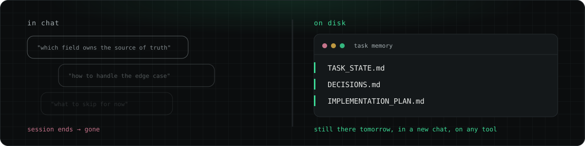
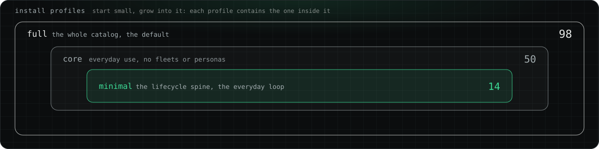
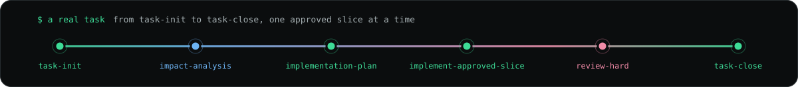
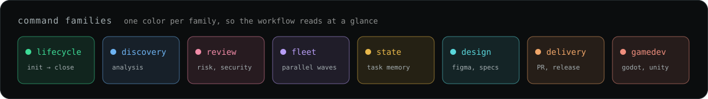

<p align="center">
  
</p>

<p align="center">
  <a href="LICENSE"></a>
  &nbsp;
  <a href="#status-license-and-contributing"></a>
</p>

> A workflow operating system for AI-assisted engineering. Task state, decisions, and plans live on disk as files, not in chat history, so context survives across sessions, tools, and restarts.

You start an AI coding session on a real feature. Twenty minutes in, you've made three decisions in chat: which field owns the source of truth, how to handle the edge case, what to skip for now. None of that gets written anywhere. You close the laptop. Tomorrow, or in a new chat, the agent has no memory of any of it. You re-explain the feature, re-litigate a decision you already made, and it starts editing files before you agreed on the approach.

Fhorja's answer: task state, decisions, and plans live in markdown files on disk, not in chat history. Open a new session, and `resume-from-state` reads `TASK_STATE.md` and tells you where you left off. A decision gets recorded once, in `DECISIONS.md`, with its reasoning, and every later step reads from it instead of guessing again. Before any code gets written, `implementation-plan` breaks the work into small slices (the smallest reviewable unit of change, each with its own scope and exit criteria). `approve-plan` then checks the plan against the recorded decisions with a blinded review, on every plan and without waiting for you (ADR-0208); a product decision the request left open becomes a provisional entry, chosen from the code and labeled as the agent's, not yours. On an attended run with a configured remote, the chain runs on its own from `task-init` through the local commit to a pushed task branch and a draft PR (ADR-0233). The draft PR is where you read the work: it lists every decision made without you, anything left unverified, and any named deliverable it could not finish. Merge, and marking the PR ready for review, stay yours.

<p align="center">
  
</p>

> **See a guided reconstruction of a real session.** [`docs/EXAMPLE_TRANSCRIPT.md`](./docs/EXAMPLE_TRANSCRIPT.md) walks the actual Fhorja task that built [fhorja.dev](https://fhorja.dev), from `task-init` to `task-close`, quoting its real decisions, slice outputs, and the tamper-evident verification log. The quoted excerpts are unedited except for cropping. The page is not a raw chat log. It exists to answer one question: is this real work, or a scripted illusion of it?

## What it is

Fhorja is a workflow operating system for AI-assisted engineering: a markdown-plus-bash specification, not an application or a hosted service. It gives solo developers and small teams a disciplined, resumable process for AI-assisted work by keeping task state, decisions, and plans as files on disk instead of in chat history.

The everyday product is a short default path of six commands: `task-init`, `implementation-plan`, `approve-plan`, `implement-approved-slice`, `branch-commit`, and `pr-package`, which on an attended run with a configured remote ends the task with a pushed task branch and a draft PR (ADR-0233); without a remote it ends with the local commit. `task-init` adds a command only when a named condition fires, and writes down which one (ADR-0184): `impact-analysis` when the scope needs more than one sentence or touches 5 or more files, `decision-interview` when a decision the prompt does not contain is needed first, which on an attended run records it as a provisional decision and keeps going rather than waiting, and `invariants-and-non-goals`, `test-strategy` and `review-hard` for an auth, payments, compliance, PII or multi-tenant surface. Around that path sit the commands that close and route work: `slice-closure`, `sync-task-state`, `pr-package`, `task-close`, and `what-next`. They all share one output contract and chain into each other, distributed to any editor as Agent Skills or legacy slash commands.

Behind that loop sits an optional catalog of <!-- count:commands -->98<!-- /count --> commands in total (parallel fleets, design-system personas, reliability and security specialists) that you install only when a task needs them. The `minimal` profile is <!-- count:commands-minimal -->23<!-- /count --> commands: the default path, `impact-analysis`, `decision-interview`, `test-strategy` and `review-hard` from the escalations, the five closing and routing commands above, `where-we-at`, `implement-slice-complement`, `capture-references`, `capture-observation`, and `incident-triage`. It also carries `verify-against-rubric`, the reviewer `approve-plan` and `review-hard` dispatch, with the three commands that reviewer routes to: `direction-adjust`, `resolve-contract-gaps`, and `contract-signoff`. `invariants-and-non-goals` ships in `core`. Pass `--profile minimal` when you want that set on both command files and skills.

It targets engineers who already use an AI coding tool (Cursor, Claude Code, and 35+ others that read the open Agent Skills standard, per [`CONTRIBUTING.md`](./CONTRIBUTING.md)) and want plan-before-code discipline without being asked to approve every step. On an attended run with a configured remote, the chain stops for one reason: an act whose audience is not bounded, meaning marking the PR ready for review, merging, publishing, or sending content outward. A decision the request left open or a check the agent cannot run on itself no longer stop the chain; both are recorded and carried into the draft PR for you to read (ADR-0233). Without a remote, those two still stop and wait. A declared assisted mode brings back every stop ADR-0233 removed: no task branch is created, open decisions and checks the agent cannot run on itself stop and wait, and the run ends at the local commit, where you start the push and the draft PR. Merge stays yours.

New here? [`WORKFLOW_DEMO.md`](./WORKFLOW_DEMO.md) is a full walkthrough with example prompts and outputs. [`docs/FAQ.md`](./docs/FAQ.md) answers what it is, which tools work, and how licensing works. You do not need to read [`WORKFLOW_OPERATING_SYSTEM.md`](./WORKFLOW_OPERATING_SYSTEM.md) first: it is the normative spec commands load sections from on demand, not a manual you read cover to cover. Run `task-init` (or `workflow-guide` if you want the explanation as you go) and let the handoffs carry you.

## Quickstart

Fhorja lives in its own repository, separate from any product codebase you work on. The repository is
named `fhorja.dev`, after the project's site; the workflow itself is Fhorja. Cloning it gives you the
workflow, not the website. You clone it once, centrally, the same way you'd install a CLI tool, not once per project. The commands then reach whichever product repo you're working in, either automatically (open that repo in an editor that reads Agent Skills, which the sync mirrors by default) or by installing straight into it with `--project`.

```bash
git clone https://github.com/Mozurok/fhorja.dev.git
cd fhorja.dev
./scripts/bootstrap-user-setup.sh          # once: seeds USER_MEMORY.md, runs a lint sanity check
./scripts/sync-workflow-slash-commands.sh  # opens a setup wizard: pick "Sync everything", or pass flags to script it
```

One more step, once per repository you work in, and it is the one that makes the rest fire: paste the
paragraph from [`templates/AGENT_DIRECTIVE.template.md`](./templates/AGENT_DIRECTIVE.template.md) into
that repository's always-loaded instruction file (`CLAUDE.md`, `AGENTS.md`, or your editor's rules
file). Installing the commands gives an agent the vocabulary; that paragraph is the instruction to use
it. Without it, an agent handed a small task does the task and never opens one, measured.

In any editor that reads `.claude/skills/` (Claude Code natively; Cursor, GitHub Copilot, Codex and others by documented compatibility), the commands are available as Agent Skills once the sync above has mirrored them to your user-level directories. Inside this repository they need no install step, because `.claude/skills/` is committed. Start your first task by running `task-init`. From there the session follows its own `Run now:` line: it continues into the next command instead of waiting for you to type it, on into the push and the draft PR when the repository has a configured remote (ADR-0233), and stops only before an act whose audience is not bounded, such as marking that PR ready for review. New to the workflow itself, not just this repo? Run `workflow-guide` instead of `task-init` first: it explains which command and editor mode to use right now, why, and the next two or three steps, so you are not guessing your way through the first task. Already fluent in the phases and just want the fast answer? Run `what-next` at any point; it gives the same routing decision with none of the explanation. Feeling stuck or looping? Run `im-stuck` instead. All three are safe to run anytime: none of them advances the plan or edits code. If you only have a few minutes before your first task, skim ahead to [Task memory on disk](#task-memory-on-disk) and [Repository layout](#repository-layout) below; they answer where things live, which is usually the first real question, before the full command catalog.

### Install profiles

Run it with no flags on a terminal and it opens a setup wizard: a state panel showing what you already have, an arrow-key menu, and a one-keystroke **Sync everything** (all skills plus all command files; that is the recommended first choice). Skills sync by default. To script it (or run it in CI), pass any flag and it runs non-interactively. A scripted run that omits `--profile` copies the `minimal` command files (<!-- count:commands-minimal -->23<!-- /count -->) and still mirrors every skill. Pass `--profile minimal` to filter both command files and skills to the minimal set:

```bash
./scripts/sync-workflow-slash-commands.sh --profile minimal  # command files and skills, minimal only
./scripts/sync-workflow-slash-commands.sh --profile core     # everyday use, no fleets or personas
./scripts/sync-workflow-slash-commands.sh --profile full     # the whole catalog
```

<p align="center">
  
</p>

The three profiles nest: `minimal` (<!-- count:commands-minimal -->23<!-- /count --> commands) inside `core` (<!-- count:commands-core -->51<!-- /count --> commands) inside `full` (<!-- count:commands -->98<!-- /count --> commands). Of that total, <!-- count:personas -->9<!-- /count --> are folder-shaped personas that ship only as skills, so the number of flat command files the installer reports copying is the remainder, not the full-profile count above. The `minimal` profile is the commands listed under [What it is](#what-it-is): the default path, which ends in `branch-commit` (with `--apply` it creates the local commit after showing the staged diff), the escalation commands a task adds on a named condition, the closing and routing commands, `implement-slice-complement` for a bounded micro-delta inside an already-implemented slice, and `verify-against-rubric` with the commands it routes to, so the review `approve-plan` runs on every plan is installed wherever `approve-plan` is. Profiles are declared in each command's `x-wos-profiles` frontmatter and enforced by lint.

Skills sync by default: they mirror to your user-level directories so they follow you across every project. Pass `--no-skills` to skip them. Two more flags worth knowing: `--clean-orphans` removes command files left behind by renamed or deleted commands, and `--project /path/to/your/repo` additionally installs into a specific product repo, alongside your user directories.

## The task loop

Every task starts on the short path and gains a command only when a named condition fires. Each command persists its result to task memory and hands off to the next:

<p align="center">
  
</p>

```
[problem-framing] -> task-init -> implementation-plan -> approve-plan
                  -> implement-approved-slice -> branch-commit --apply
```

Escalations, each added only when its condition fires (ADR-0184):

- `impact-analysis`, before the plan: the scope needs more than one sentence, or the change touches 5 or more files.
- `decision-interview`: a decision the prompt does not contain, several packages, or a new external service; on an attended run with a remote it records the recommended option as a provisional decision and continues (ADR-0233).
- `invariants-and-non-goals`, `test-strategy` and `review-hard`: an auth, payments, compliance, PII or multi-tenant surface.

`problem-framing` is an optional step before any task folder exists: it questions whether the stated problem is the right one, writes a one-page `BRIEF.md` that `task-init` consumes, and routes to `task-init` (or to `what-next` if a task is already active). `task-init` writes the fired conditions on an `Escalations:` line, or `Escalations: none`; uncertainty on its own adds nothing. `approve-plan` runs on every plan with a blinded review (ADR-0208), except on the one-slice route: for a one-sentence change to at most two named files with every decision in the brief and no provisional decision, `task-init` writes the approved slice itself and `scripts/check-doc-sync.sh --against HEAD` replaces the review (ADR-0225). `branch-commit --apply` creates the local commit after the staged diff is shown. A plan with several slices closes each one with `slice-closure`; on an attended run with a configured remote, `pr-package --apply` then pushes the branch and opens a draft PR on its own, without waiting to be asked (ADR-0233), and `task-close` archives the finished task once the work is merged. Marking the PR ready for review and merging stay yours. A declared `Operating mode: strict` keeps invariants and tests even on a small file.

## Core concepts

- **Task memory on disk, not chat.** Each task is a folder of markdown files, kept out of version control. See [Task memory on disk](#task-memory-on-disk) below for the file list.
- **Commands are the interface.** One markdown file per workflow action, grouped into <!-- count:command-categories -->15<!-- /count --> lifecycle categories. [`commands/*.md`](./commands/) is the canonical source; the `.claude/skills/` Agent Skills are generated from it and never hand-edited.
- **Plan before code, in small slices.** Work is broken into the smallest reviewable slices, each planned, approved, then implemented with a minimal diff.
- **One output contract.** Every command ends the same way: an artifact-changes block, a short transcript, and a handoff naming the next command, editor mode (Ask, Plan, Agent, or Debug, whatever your tool calls its interaction modes), and work complexity, so steps chain without going silent.
- **Written, and listed.** Every command writes its task files directly, in every editor mode, and lists each one under `### Artifact changes` (ADR-0199). A wrong write is undone by editing the file, and a plan still passes `approve-plan`'s blinded review before any code is written.
- **Operating modes and task shapes.** A minimal, strict, teaching, or assisted posture ([ADR-0008](./docs/adr/0008-operating-modes.md)) and a small set of recognized task shapes ([ADR-0009](./docs/adr/0009-task-shape-system.md)) let the same commands flex from a quick hotfix to a fully governed multi-slice build.
- **Capability routing, not model names.** Commands declare work complexity (LOW, MEDIUM, HIGH). A `suggested-model` frontmatter field gives a default hint mapped in [`wos/model-routing.md`](./wos/model-routing.md), and nothing requires that model.

## Command clusters

<!-- count:commands -->98<!-- /count --> commands. The table below groups them editorially, by family, and a command can appear in more than one row: `app-runtime-verify` is both an execution gate and the Unity surface. The spec's `## Command categories` is the other axis, where every command sits in exactly one of <!-- count:command-categories -->15<!-- /count --> categories. Same commands, two questions: what family does this belong to, and where does it sit in the lifecycle.

<p align="center">
  
</p>

| Cluster | A few commands | What it does |
|---|---|---|
| Core task lifecycle | `task-init`, `implementation-plan`, `approve-plan`, `implement-approved-slice`, `branch-commit` | The default path every task starts on, from creation to a local commit; `slice-closure`, `pr-package` and `task-close` close and deliver. |
| State, navigation, recovery | `resume-from-state`, `what-next`, `im-stuck`, `portfolio-review` | Resuming, reconciling drift, and routing to the next step, without advancing the plan itself. |
| Project initialization | `project-bootstrap`, `capture-references` | The zero-state entry: creates project-level memory before any task folder exists. |
| Discovery, scoping, design-time review | `code-locate`, `impact-analysis`, `decision-interview`, `api-contract-review`, `frontend-system-design`, `backend-system-design` | Locating code, sizing blast radius, and pre-implementation contract or architecture RFCs. |
| Design system (WOS-UI) | `design-bootstrap`, `component-spec`, `screen-spec`, `image-to-spec`, `foundation-audit` | Figma-grounded token bootstrapping, per-component and per-screen specs, and drift audits. |
| Database context | `db-context-supabase`, `db-context-postgres` | Read-only schema introspection persisted as `DB_CONTEXT.md`; never destructive SQL. |
| Contract and decision hardening | `resolve-contract-gaps`, `contract-signoff`, `direction-adjust` | Turning ambiguity, contradictions, or a mid-task correction into a canonical decision set. |
| Planning, validation, specialist review | `implementation-plan`, `test-strategy`, `rls-auth-boundary-auditor`, `migration-safety-steward`, `a11y-audit`, `performance-budget` | Slicing work and gating it with specialist reviewer personas. |
| Execution and closure | `implement-approved-slice`, `implement-fleet`, `review-hard`, `security-review`, `godot-runtime-verify`, `app-runtime-verify` | The official execution path plus proactive review, runtime-verification gates, and closure. |
| Delivery and communication | `pr-package`, `pr-feedback-ingest`, `post-review-pivot`, `team-update` | Packaging a real git diff into PR artifacts, or turning review feedback into a backlog. |
| Prompt tooling | `prompt-shape` | Shapes a copy-paste-ready prompt aligned to the intended editor mode. |
| Godot 2D and 3D game-dev cluster | `godot-scene-plan`, `godot-runtime-verify` | Scene planning and a press-play runtime gate for a 2D or 3D target, added on top of the general lifecycle; a 3D plan must declare its renderer tier. See [ADR-0069](./docs/adr/0069-godot-2d-mobile-cluster.md) and [ADR-0117](./docs/adr/0117-godot-3d-dimension-routed-surface.md). |
| Unity 3D game-dev widening | `unity-scene-plan`, `app-runtime-verify` | GameObject and component planning for a Unity 3D feature, verified through `app-runtime-verify`'s Unity adapter rather than a dedicated runtime-verify command. See [ADR-0130](./docs/adr/0130-unity-3d-mobile-widening.md) and [ADR-0132](./docs/adr/0132-unity-scene-plan-command.md). |
| Autonomous delivery track | `autonomous-run`, `autonomous-board` | A full-profile direct-use reference dispatcher for one approved task and one supervised session. It emits PROPOSED diffs and never commits or merges. See [ADR-0197](./docs/adr/0197-autonomous-run-reference-dispatcher-boundary.md). |
| Fleet (orchestrator-workers) variants | `implement-fleet`, `task-init-fleet`, `external-research-fleet`, `screen-spec-fleet` | Parallelizes an existing single-agent command across independent slices, screens, or research angles once file scopes are disjoint (ADR-0038, ADR-0041). |

### Two clusters worth a closer look

Frontend (`frontend-system-design`, `graphql-contract-review`, `frontend-architecture-review`, plus a mobile surface on `performance-budget`) and the Godot 2D and 3D game-dev cluster (`godot-scene-plan`, `godot-runtime-verify`) are additive, capability-routed groups, not separate products. Both reuse the whole lifecycle and add only the steps it doesn't already cover, and both are recorded in their own ADRs: the frontend set from [ADR-0065](./docs/adr/0065-frontend-system-design-rfc-command.md) through [ADR-0068](./docs/adr/0068-mobile-performance-budget-surface.md), Godot in [ADR-0069](./docs/adr/0069-godot-2d-mobile-cluster.md) and [ADR-0117](./docs/adr/0117-godot-3d-dimension-routed-surface.md). `godot-runtime-verify` runs the scene and reads the real captured debugger output as Layer-1 runtime evidence ([ADR-0048](./docs/adr/0048-deterministic-gate-evidence.md)) rather than a claimed-but-unshown result, the same evidence bar the rest of the workflow holds a passing deterministic gate to.

## Task memory on disk

Each task lives in a folder under `projects/`, in the repository you run `task-init` from, which after an install is usually your product repository. Task memory stays out of git in both layouts ([ADR-0007](./docs/adr/0007-project-level-memory.md)). In a clone of this repository the root `.gitignore` lists `projects/`. Anywhere else, the command that creates `projects/` also writes a `projects/.gitignore` holding `*`, which ignores the whole tree and never touches your own `.gitignore` ([ADR-0223](./docs/adr/0223-task-memory-ignores-itself-in-the-task-repository.md)). Delete that file if your team wants the tree tracked:

```text
projects/<client>__<project>/active/YYYY-MM-DD_<task-slug>/
  README.md               # human summary
  TASK_STATE.md           # authoritative operational memory; read this to resume
  SOURCE_OF_TRUTH.md      # canonical facts, including the path to the actual codebase this task changes
  DECISIONS.md            # locked decisions with reasoning, plus provisional ones an attended run chose for you
  IMPLEMENTATION_PLAN.md  # approved slices with scope, ordering, and exit criteria
  BRIEF.md                # optional; written by problem-framing, consumed by task-init
  LEARNINGS.md            # optional; written by task-close when the task left a signal, read by the next task-init
```

None of this is your code. Fhorja never stores or edits your product source inside its own repo; SOURCE_OF_TRUTH.md's active codebase / repo field (or, for multi-repo tasks, its `## Repositories` section) is a pointer to wherever your actual codebase already lives, in its own separate git history. `task-init` asks for that path directly; everything under `projects/` only tracks the plan and decisions about the change, never the change itself.

If `TASK_STATE.md` and `IMPLEMENTATION_PLAN.md` disagree, `state-reconcile` resolves the conflict before work continues.

## Repository layout

```text
WORKFLOW_OPERATING_SYSTEM.md   # the normative spec (read this if anything conflicts)
AGENTS.md                      # rules for any coding agent working in this tree
commands/                      # canonical command files, one per workflow action
  <name>/SKILL.md               # folder-shaped specialist persona commands
  _shared/                       # shared blocks propagated by sync-shared-blocks.sh
wos/                            # lazy-loaded reference topics
  bug-classes/                   # the curated bug-class library
docs/
  FAQ.md                        # what it is, which tools work, licensing
  MIGRATION.md                  # adoption, forks, and upgrade guide
  adr/                          # Architecture Decision Records
  command-catalog.html          # browsable per-command reference (generated)
  command-catalog.json          # machine-readable manifest (generated)
evals/                          # manual eval harness for the output contracts
templates/                      # starting points for task artifacts
scripts/                        # lint, sync, build, and helper scripts
recommended-mcp-configs/        # example MCP configs for Figma, Supabase, and Trigger.dev
projects/                       # your task memory (gitignored; never committed)
.claude/skills/                 # generated Agent Skills (never hand-edit)
.github/workflows/lint.yml      # CI
```

Paths above are relative to wherever you cloned the repo; the folder name itself isn't load-bearing. The curated library it draws on: <!-- count:bug-templates -->81<!-- /count --> bug-class templates across <!-- count:bug-categories -->22<!-- /count --> categories, <!-- count:anti-patterns -->29<!-- /count --> anti-patterns, <!-- count:entry-points -->21<!-- /count --> entry points, <!-- count:fleet-commands -->7<!-- /count --> parallel fleet commands, and <!-- count:personas -->9<!-- /count --> senior-specialist personas, with <!-- count:wos-topics -->55<!-- /count --> lazy-loaded reference topics. Full tree and governance-file inventory: [`wos/repository-structure.md`](./wos/repository-structure.md).

## How it stays honest

- **One source of truth per command.** `commands/<name>.md` is canonical. `scripts/build-agent-skills.sh` generates `.claude/skills/<name>/SKILL.md` from it, so any Agent-Skills-compatible tool gets the same command with no extra step. Editing a generated skill by hand is prohibited; lint fails CI on drift.
- **Registry membership.** Per [ADR-0029](./docs/adr/0029-drift-guards-registry-and-count-markers.md), narrowed from four surfaces to three by [ADR-0165](./docs/adr/0165-per-command-data-leaves-the-always-read-spec.md) when the per-command Command roles index left the always-read spec, every command must appear in three discoverability surfaces: the Command categories list in `WORKFLOW_OPERATING_SYSTEM.md`, [`wos/command-roles.md`](./wos/command-roles.md), and [`COMMAND_PROMPT_STUBS.md`](./COMMAND_PROMPT_STUBS.md). Lint fails on a gap in either direction.
- **Count markers.** Prose claims about on-disk quantities, like the <!-- count:commands -->98<!-- /count --> commands above, use `<!-- count:KIND -->N<!-- /count -->` markers that lint checks against the live count, which is why the numbers in this README are trustworthy.
- **Index rows and regression net.** Every ADR has a row in [`docs/adr/README.md`](./docs/adr/README.md); every eval scenario has a row in [`evals/README.md`](./evals/README.md). The decision history is <!-- count:adrs -->234<!-- /count --> Architecture Decision Records. Accepted Decision text is immutable; the Status line is maintained and is updated when another ADR supersedes it. The regression net is <!-- count:scenarios -->142<!-- /count --> scenarios, run with `evals/scripts/run-evals.sh`.

## Command catalog

The full per-command list lives in [`docs/command-catalog.html`](./docs/command-catalog.html), a browsable page with each command's description, an example prompt, and its metadata, grouped by lifecycle category. [`docs/command-catalog.json`](./docs/command-catalog.json) is the same list as a machine-readable manifest. Both are generated from `commands/*.md` by `scripts/build-command-catalog.py`. For each command's role and its usual next step, see [`wos/command-roles.md`](./wos/command-roles.md); for the families at a glance, see [Command clusters](#command-clusters) above.

## Tool support

The same `commands/*.md` files are published as Agent Skills, an open standard, so the workflow is not locked to one editor.

| Tool | Surface | Notes |
|---|---|---|
| Cursor | Slash commands + Agent Skills | Primary environment. Commands go to `~/.cursor/commands`. Cursor 3.17.8 or later reads the skills from `~/.agents/skills`; `--cursor-skills` also writes `~/.cursor/skills`, which only Cloud Agents sync needs. |
| Claude Code | Slash commands + Agent Skills | Commands go to `~/.claude/commands` and skills to `~/.claude/skills`; a repository's own `.claude/skills/` is read automatically. Claude Code does not read `~/.agents/skills` (checked 2026-09-23). |
| Codex | Custom prompts + Agent Skills | Prompts go to `~/.codex/prompts` (deprecated); the preferred skills go to `~/.agents/skills` by default. |
| Kimi Code | Agent Skills | No slash-command directory exists, so commands arrive as skills in `~/.agents/skills` (which Kimi scans natively) and are invoked as `/skill:<name>`. The runtime payload goes to `<kimi-home>/workflow-docs`. |
| Other tools | Agent Skills | Any Agent-Skills-aware tool reads `.claude/skills/` or the mirrored user-level paths. See [`docs/FAQ.md`](./docs/FAQ.md) for the full list. |

A default sync writes the skills to <!-- skill-roots -->`~/.claude/skills` and `~/.agents/skills`<!-- /skill-roots -->, one root per reader: Claude Code reads the first, and Codex, Kimi Code and Cursor read the second. Before ADR-0228 the sync wrote `~/.cursor/skills` too, so Cursor listed each skill twice; `--clean-orphans` removes the Fhorja skills left there, after asking, and never another skill. Claude Code also reads the command files in `~/.claude/commands`, so a command installed both ways may appear twice in its listing; that duplicate is not measured yet. `--print-skill-overrides=core` prints a Claude Code `skillOverrides` object that keeps only the names of the skills outside core, and writes nothing.

The Figma design-system commands need a configured MCP server; without one, they stop at a precondition check with an actionable note. `db-context-supabase` prefers a Supabase MCP server and falls back to the local Supabase CLI, stopping only when neither is available. `db-context-postgres` needs no MCP: it reads the database through `psql` or `pg_dump`. Every other command works with no MCP. Example configs live in [`recommended-mcp-configs/`](./recommended-mcp-configs/).

## Key scripts

| Script | What it does |
|---|---|
| `scripts/bootstrap-user-setup.sh` | First-time setup: seeds `USER_MEMORY.md` and runs a lint sanity check. |
| `scripts/sync-workflow-slash-commands.sh` | Copies commands and skills to Cursor, Claude Code, Codex, and Kimi Code. Run bare on a terminal for a setup wizard; skills sync by default. Accepts `--profile`, `--no-skills`, `--clean-orphans`, `--with-docs`, `--project`, and the composable `--cursor-only`, `--claude-only`, `--codex-only`, `--kimi-only`. |
| `scripts/lint-commands.sh` | Validates every command file: required sections, frontmatter, shared-block drift, forbidden bytes, registry membership, count markers, index-row membership, skills drift, and the orchestrator contract (a `max_fanout` above the platform's 20-concurrent limit, or an `orchestrator: true` command that never names an agent type). Run before committing a command edit. |
| `scripts/build-agent-skills.sh` | Generates `.claude/skills/<name>/SKILL.md` from each command file. Idempotent; supports `--check` for CI drift detection. |
| `scripts/build-command-catalog.py` | Generates `docs/command-catalog.html` and `docs/command-catalog.json`. |
| `scripts/sync-shared-blocks.sh` | Propagates `commands/_shared/<name>.md` content into every command that references it. |
| `scripts/measure-tokens.py` | Estimates the token footprint of the spec, commands, and task artifacts. |

## Eval harness and quality

The workflow ships a regression net of <!-- count:scenarios -->142<!-- /count --> scenarios under `evals/scenarios/`, indexed in [`evals/README.md`](./evals/README.md). Each scenario is self-contained: a full input prompt, the expected response shape, and numbered pass criteria a reviewer checks by reading the model output. Most are behavioral and reviewed by hand with `evals/scripts/run-evals.sh`. The subset that reduces to a static repo invariant runs in CI on every push via `evals/scripts/structural-evals.py`, so a broken handoff basename, a stale count marker, or a malformed scenario fails the build rather than waiting for a manual pass. That harness does not run a model and makes no claim of full automated coverage.

`repo-consistency-sweep` draws on the curated bug-class library in `wos/bug-classes/`, auto-discovered at sweep time; project-local templates can override a global one on name collision.

## CI

[`.github/workflows/lint.yml`](.github/workflows/lint.yml) runs on every push and pull request to `main`, with six jobs:

- `lint-commands`: structural and drift checks, including skills-drift detection.
- `validate-skills-spec`: validates every `.claude/skills/<name>/` against the open Agent Skills specification.
- `structural-evals`: the automatable eval-scenario subset (`evals/scripts/structural-evals.py`); no model is invoked.
- `script-tests`: the allowlisted script test suites plus the autonomy helper tests.
- `lint-shellcheck`: runs shellcheck over `scripts/`.
- `check-doc-sync`: verifies command, ADR, and WOS section references resolve.

## Documentation

- [`WORKFLOW_OPERATING_SYSTEM.md`](./WORKFLOW_OPERATING_SYSTEM.md): the normative spec. The source of truth if anything conflicts.
- [`WORKFLOW_DEMO.md`](./WORKFLOW_DEMO.md): a full walkthrough with example prompts and outputs.
- [`docs/FAQ.md`](./docs/FAQ.md): what it is, which tools work, licensing.
- [`docs/MIGRATION.md`](./docs/MIGRATION.md): adoption, forks, and upgrade guide.
- [`docs/adr/README.md`](./docs/adr/README.md): the decision records, the why behind every load-bearing choice.
- [`wos/`](./wos/): lazy-loaded reference topics, including [`wos/repository-structure.md`](./wos/repository-structure.md), [`wos/context-budget.md`](./wos/context-budget.md), [`wos/command-roles.md`](./wos/command-roles.md), and [`wos/workflow-patterns.md`](./wos/workflow-patterns.md).

## Who built this

Fhorja is built and maintained by Bruno Mazurok, a fullstack engineer with about fourteen years in the field, close to five of them at Coinbase. He built it to fix a problem he kept hitting in his own AI-assisted work: the decisions and context of a task lived in the chat and vanished the moment the session closed. The name comes from *forja*, Portuguese for forge, the place where raw material is worked into something durable.

## Status, license, and contributing

**Status.** v1.1.0, the cross-model dogfood release (see CHANGELOG for the 1.1.0 section). The contract for command outputs and `TASK_STATE.md` is the defined public API: breaking changes to either mean a major version bump per [SemVer](https://semver.org/). See [`CHANGELOG.md`](./CHANGELOG.md) for what changed and [`ROADMAP.md`](./ROADMAP.md) for what's next.

**Governance.** A personal open-source project under single-maintainer (BDFL) governance while it matures toward a community model; the contribution flow is documented in [`CONTRIBUTING.md`](./CONTRIBUTING.md).

**License.** [MIT](LICENSE). Copyright (c) 2026 Bruno Mazurok. Use it, fork it, adapt it, and build on it, in personal, company, or commercial work, with no share-alike obligation. The only requirement is keeping the copyright and license notice. Contributions are accepted under the same MIT terms with a DCO sign-off (see [`CONTRIBUTING.md`](./CONTRIBUTING.md)).

**Contributing.** Welcome. Read [`CONTRIBUTING.md`](./CONTRIBUTING.md) for the flow, code style, and the DCO sign-off. Edit `commands/*.md` (canonical), never the generated skills, and run `./scripts/lint-commands.sh` before a PR.

**Security.** Report concerns via [`SECURITY.md`](./SECURITY.md). Community conduct follows the [Contributor Covenant 2.1](./CODE_OF_CONDUCT.md).

Built with the system managing its own evolution: this workflow is used to develop this workflow.
