# Workflow demo: one feature, start to finish

This document shows the workflow working, end to end, on a single feature request. [`README.md`](./README.md) explains what Fhorja is and why it exists. This file exists to show it running. Normative rules and the exact command contracts live in [`WORKFLOW_OPERATING_SYSTEM.md`](./WORKFLOW_OPERATING_SYSTEM.md) and in each file under [`commands/`](./commands/). For one-line copy-paste starters per command, use [`COMMAND_PROMPT_STUBS.md`](./COMMAND_PROMPT_STUBS.md) instead.

**This walkthrough is entirely synthetic.** The project, the task, the file names, the schema, and every example output below were invented for this document. Nothing here is copied from a real product, client, or codebase.

## The feature, in one paragraph

You maintain a small invoicing app (Next.js, Supabase for auth and data). A customer asks for a CSV export button on the invoices list, so they can pull the currently filtered invoices into a spreadsheet. It sounds small. It touches a tenant-scoped database table through row-level security, needs a decision about what happens when someone tries to export ten thousand rows, and ends with a PR round and a real reviewer comment. That is enough shape to walk the full lifecycle once, including two of the workflow's opt-in commands that most demos skip.

## Before the first command

Three things are worth knowing before you read turn one:

- Every command ends the same way: an `### Artifact changes` block, a short `### Command transcript`, and a `### Handoff` that names the next command, the editor mode, and why. That shape repeats below for every turn. Once you have seen it twice, you can skim the rest.
- This walkthrough follows one shape among several. The [Other task shapes](#other-task-shapes) section below covers small tasks, docs-only tasks, refactors, and incident response, each with its own shortcut through the chain.
- The task also runs under one of three [Operating modes](#operating-modes): `minimal`, `strict`, or `teaching`. This walkthrough uses the default (no named mode), which is closest to `minimal` in ceremony.

## The command chain

```mermaid
flowchart LR
  subgraph discover ["Discovery"]
    taskInit["task-init"]
    impact["impact-analysis"]
    decide["decision-interview"]
  end
  subgraph plan ["Plan"]
    planCmd["implementation-plan"]
    approve["approve-plan"]
  end
  subgraph run ["Execute"]
    impl["implement-approved-slice"]
    fleetCmd["implement-fleet"]
    closeSlice["slice-closure"]
    review["review-hard"]
    sweep["repo-consistency-sweep"]
  end
  subgraph ship ["Deliver and close"]
    pkg["pr-package"]
    feedback["pr-feedback-ingest"]
    pivot["post-review-pivot"]
    taskClose["task-close"]
  end

  taskInit --> impact --> decide --> planCmd --> approve
  approve -->|"the common case: a sequential chain of slices"| impl
  approve -.->|"ADR-0042: when 2+ approved slices are independent, route here instead"| fleetCmd
  fleetCmd --> closeSlice
  impl --> closeSlice --> review --> sweep --> pkg --> taskClose
  pkg -.->|"a reviewer or bot comments on the PR"| feedback
  feedback -->|"corrective: fix under the existing contract"| impl
  feedback -.->|"the feedback changes the contract itself"| pivot
```



Two branches in this diagram are worth naming, since a diagram alone will not explain them:

- **`approve-plan` chooses between two execution commands.** Most tasks, including this one, are a sequential chain of slices, so `approve-plan` routes to `implement-approved-slice`. When the plan's execution waves show two or more independent slices ready at once (ADR-0042), it routes to `implement-fleet` instead, which runs them in parallel worktrees. This walkthrough never hits that branch: its two slices depend on each other, so there is only ever one slice ready at a time.
- **`pr-feedback-ingest` chooses between two outcomes.** A corrective comment (a bug, a missing test, a style nit) routes back to `implement-approved-slice`. A comment that asks for a different contract or product direction routes to `post-review-pivot` instead, which is a bigger conversation than a quick fix. Turn 12 below shows the corrective path. The paragraph right after it shows what the other branch would have looked like.

Four more commands are not in the diagram because they are opt-in: you reach for them only when the task actually needs them, and skipping them is never wrong. This walkthrough uses all four, so you can see what each looks like in practice rather than just its one-line description.

| Command | Why it shows up here | Where |
|---|---|---|
| `db-context-supabase` | The export has to respect an existing row-level security policy; better to read the real schema than assume it. | After impact-analysis |
| `capture-references` | The export needs a CSV library; the streaming API is worth grounding in its real docs before deciding the row-cap policy. | Before decision-interview |
| `capture-observation` | A small thing worth remembering surfaces mid-implementation, but it is not a decision and does not need a full state sync. | During slice 1 |
| `direction-adjust` | A small course correction gets realized mid-implementation: the export button needs a disabled state. | During slice 2 |

## The task folder

Everything below lives under:

`projects/acme__invoicer/active/2026-07-08_csv-export-for-invoices/`

`task-init` creates the five required files. Optional files (`IMPACT_ANALYSIS.md`, `DB_CONTEXT.md`, `SLICES/`) appear as the phases that produce them run.

---

## Turn 1: start the task (`task-init`)

The objective is specific enough to skip `problem-framing` (that command exists for fuzzy or possibly mis-scoped objectives; "add a CSV export button" is not one).

### What you send

```text
Run @commands/task-init.md.
Project folder: acme__invoicer
Task slug: csv-export-for-invoices
One-line goal: Add a CSV export button to the invoices list that downloads the currently filtered invoices.
Product repo: ~/code/invoicer (Next.js + Supabase)
```

### What you get back (abbreviated)

```markdown
### Artifact changes
- `projects/acme__invoicer/active/2026-07-08_csv-export-for-invoices/README.md`: `APPLIED` (created)
- `.../TASK_STATE.md`: `APPLIED` (created; phase: discovery; Requested deliverables: "CSV export button on invoices list" [in-scope], "Export respects tenant row-level security" [in-scope])
- `.../SOURCE_OF_TRUTH.md`: `APPLIED` (created)
- `.../DECISIONS.md`: `APPLIED` (created, empty)
- `.../IMPLEMENTATION_PLAN.md`: `APPLIED` (skeleton)

### Command transcript
- Initialized the task folder and the five required files.
- Seeded `## Requested deliverables` with the two things the user named.

### Handoff
Run now: /impact-analysis
Mode: Ask
Work complexity: LOW
Reason: Bounded feature; need the touch surfaces confirmed before deciding anything.
```

---

## Turn 2: bounded understanding (`impact-analysis`)

### What you send

```text
Run @commands/impact-analysis.md for the same task folder.
```

### What you get back (abbreviated)

```markdown
### Artifact changes
- `IMPACT_ANALYSIS.md`: `PROPOSED` (full draft)
- `TASK_STATE.md`: `PROPOSED` (Active files in scope, Risks to watch)

### Command transcript
- Touch surfaces: the invoices list page, a new export API route, the `public.invoices` table (tenant-scoped via RLS).
- Risk flagged: the export query must carry the same tenant predicate as the list view, or a customer could download another tenant's invoices.
- Risk flagged: an unbounded export on a large filtered set could be slow or memory-heavy.

### Handoff
Run now: /db-context-supabase
Mode: Ask
Work complexity: LOW
Reason: The RLS risk is concrete enough to verify against the real schema before deciding anything.
```

---

### Aside: verify the real schema (`db-context-supabase`, opt-in)

This is an opt-in command, so it gets a lighter example than a full turn: one request, one focused answer, no ceremony beyond what it needs.

**What you send:**

```text
Run @commands/db-context-supabase.md for the same task folder.
Scope: public.invoices
Depth: tables+rls
```

**What you get back (abbreviated):**

```markdown
### Artifact changes
- `DB_CONTEXT.md`: `PROPOSED` (create)
- `SOURCE_OF_TRUTH.md`: `PROPOSED` (append `## DB context` pointer)

### Command transcript
- MCP precondition check: Supabase MCP reachable.
- Introspected `public.invoices`: 9 columns, RLS enabled, one policy.

### Handoff
Run now: /capture-references
Mode: Ask
Work complexity: LOW
Reason: Ground the CSV library choice before the row-cap decision.
```

The relevant excerpt from `DB_CONTEXT.md`:

```text
### public.invoices
- Columns: id uuid [PK], tenant_id uuid [NOT NULL], customer_name text, amount_cents integer, currency text, status text, issued_at timestamptz, due_at timestamptz
- RLS enabled: yes
- RLS policies:
  - tenant_isolation [ALL] FOR authenticated: USING (tenant_id = (auth.jwt() ->> 'tenant_id')::uuid)
```

This one fact (`tenant_isolation` filters on `tenant_id`) is what `implementation-plan` and `implement-approved-slice` build against later instead of assuming the export query is safe.

---

### Aside: ground the CSV library (`capture-references`, opt-in)

**What you send:**

```text
Run @commands/capture-references.md.
Project: acme__invoicer
Inputs: https://example.com/docs/csv-stream-lite/streaming-api
Tags: csv-export
```

**What you get back (abbreviated):**

```markdown
### Artifact changes
- `REFERENCES.md`: `PROPOSED` (new entry under `## csv-export`)

### Command transcript
- Fetched and summarized 1 source; 0 duplicates.

### Handoff
Run now: /decision-interview
Mode: Ask
Work complexity: MEDIUM
Reason: The library's streaming behavior is now grounded; the row-cap and format decisions can be made against real capability instead of a guess.
```

The entry appended to `REFERENCES.md`:

```text
## csv-export
### csv-stream-lite streaming API
- URL: https://example.com/docs/csv-stream-lite/streaming-api
- Accessed: 2026-07-08
- Summary: csv-stream-lite exposes a Node stream transform that writes rows incrementally rather than building the whole CSV in memory; it caps at roughly 50,000 rows/second on a single core before backpressure matters.
- Context within project: first reference in this project.
- Key points:
  - "createCsvStream returns a standard Node Transform stream; pipe database rows into it and pipe its output to any writable, including an HTTP response."
- Implementation contract:
  - Signature: `createCsvStream(columns: string[]): Transform`
  - Example: `dbRows.pipe(createCsvStream(['id', 'customer_name', 'amount_cents'])).pipe(res)`
  - Version: 3.x
- Tags: csv-export
- Consumes-by: implementation-plan
```

---

## Turn 3: lock the decisions (`decision-interview`)

### What you send

```text
Run @commands/decision-interview.md for the same task folder.
Open questions: row cap for a synchronous export, CSV format details, filename convention.
```

### What you get back (abbreviated)

```markdown
### Artifact changes
- `DECISIONS.md`: `PROPOSED` (three new entries)
- `TASK_STATE.md`: `PROPOSED` (Canonical decisions)

### Command transcript
- Asked three targeted questions; user answered all three.
- No conflict with existing invariants (none locked yet for this task).

### Handoff
Run now: /implementation-plan
Mode: Plan
Work complexity: MEDIUM
Reason: Decisions are locked; boundaries are clear enough to slice safely.
```

The three entries added to `DECISIONS.md`:

```text
D-1: Row cap for synchronous export
Exports above 5,000 filtered rows are rejected with a message asking the user to narrow the filter. No background job in this pass; YAGNI until a real customer hits the cap.

D-2: CSV format
Comma-delimited, UTF-8 with a BOM (so Excel opens it without a mangled first column), one header row matching the visible list columns.

D-3: Filename convention
`invoices-<tenant-slug>-<YYYY-MM-DD>.csv`, generated at request time.
```

---

## Turn 4: plan the slices (`implementation-plan`)

### What you send

```text
Run @commands/implementation-plan.md for the same task folder.
```

### What you get back (abbreviated)

```markdown
### Artifact changes
- `IMPLEMENTATION_PLAN.md`: `PROPOSED` (2 slices + Execution waves)
- `TASK_STATE.md`: `PROPOSED` (phase -> planning)

### Command transcript
- Sliced into an API-side export and a UI-side button, in that order (the button needs a real endpoint to call).
- Execution waves: Wave 1 [Slice 01]; Wave 2 [Slice 02]. A pure chain, not a fan-out.

### Handoff
Run now: /approve-plan
Mode: Agent
Work complexity: LOW
Reason: Plan is complete with no open clarification markers; lock it before execution begins.
```

The two slices, abbreviated:

```text
### Slice 01: CSV export API route
Scope: app/api/invoices/export/route.ts, lib/csv/build-invoice-export.ts
Depends-on: none
Work complexity: MEDIUM (touches the RLS-scoped query and a new dependency)
Exit criteria: WHEN a request is made with an authenticated tenant session and a filter under 5,000 rows the API SHALL stream back a CSV matching D-2 and D-3, scoped to that tenant's invoices only.

### Slice 02: Export button on the invoices list
Scope: app/invoices/InvoiceListToolbar.tsx
Depends-on: Slice 01
Work complexity: LOW (UI wiring against an already-tested endpoint)
Exit criteria: WHEN the user clicks "Export CSV" on a filtered list the UI SHALL call the Slice 01 endpoint with the active filters and trigger a file download, or SHALL show the row-cap message when the API rejects the request.

## Execution waves
Wave 1: [01]
Wave 2: [02]
```

---

## Turn 5: lock the baseline (`approve-plan`)

### What you send

```text
Run @commands/approve-plan.md for the same task folder.
```

### What you get back (abbreviated)

```markdown
### Artifact changes
- `IMPLEMENTATION_PLAN.md`: `APPLIED` (status: approved)
- `TASK_STATE.md`: `APPLIED` (approval stamp; recommended next step: Slice 01)

### Command transcript
- Cross-checked slices against DECISIONS.md: no gap.
- Execution waves are a pure chain (max wave size 1), so routing goes to implement-approved-slice, not implement-fleet.

### Handoff
Run now: /implement-approved-slice
Mode: Agent
Work complexity: MEDIUM
Reason: Slice 01 touches the RLS-scoped query; correctness here matters more than speed.
```

---

## Turn 6: execute slice 01 (`implement-approved-slice`)

### What you send

```text
Run @commands/implement-approved-slice.md for the same task folder.
Approved slice only: Slice 01 (CSV export API route).
```

### What you get back (abbreviated)

```markdown
### Artifact changes
- (Product repo) `app/api/invoices/export/route.ts`: `APPLIED` (created)
- (Product repo) `lib/csv/build-invoice-export.ts`: `APPLIED` (created)
- `TASK_STATE.md`: `APPLIED` (Slice 01 marked implemented, evidence linked)

### Command transcript
- Grounded in: REFERENCES.md `csv-stream-lite streaming API` entry (the streaming Transform signature).
- Query reuses the existing tenant-scoped Supabase client, so the `tenant_isolation` RLS policy from DB_CONTEXT.md applies unchanged; no service-role bypass added.
- Ran the route against a local seed with 3 tenants; each request returned only its own tenant's rows.
- Row-cap (D-1) enforced with a 5,001st-row check before streaming starts, so a large export fails fast instead of after downloading most of it.

### Handoff
Run now: /slice-closure
Mode: Ask
Work complexity: LOW
Reason: Exit criteria are met and evidence is recorded; a closure judgment is enough before moving on.
```

---

### Aside: something worth remembering (`capture-observation`, opt-in)

While building the export route, you notice something not urgent enough to act on now, but worth not losing.

**What you send:**

```text
Run @commands/capture-observation.md for the same task folder.
Observation: date columns (issued_at, due_at) export in UTC; if a customer's spreadsheet app localizes them, invoice dates could look off by a day near midnight. Not in scope for this task; worth a follow-up if it comes up.
Tag: concern
```

**What you get back (abbreviated):**

```markdown
### Artifact changes
- `TASK_STATE.md`: `PROPOSED` (one line appended to `## Observations`)

### Command transcript
- Appended verbatim; no other section touched.

### Handoff
Run now: /slice-closure
Mode: Ask
Work complexity: LOW
Reason: Resume the closure judgment that was in progress before this capture.
```

The line added to `TASK_STATE.md`:

```text
## Observations
- [2026-07-08] [concern] date columns export in UTC; a customer's spreadsheet app localizing them could show invoice dates off by a day near midnight. Out of scope for this task.
```

---

## Turn 7: close slice 01 (`slice-closure`)

Imagine a day passes here. The Handoff below switches to **Mode B** (cross-session) because the next command opens in a new chat tomorrow.

### What you send

```text
Run @commands/slice-closure.md for the same task folder.
```

### What you get back (abbreviated)

```markdown
### Artifact changes
- `TASK_STATE.md`: `APPLIED` (Last completed step, In progress, Recommended next step, Current closure target)

### Command transcript
- Exit criteria for Slice 01 verified against the recorded test run; all met.
- Commit-evidence floor (ADR-0084): work is committed on `task/csv-export-for-invoices` (commit a1b2c3d); classified ready to close.

### Deliverable status (per ADR-0056)
- "Export respects tenant row-level security": done (Slice 01 evidence above).
- "CSV export button on invoices list": in-scope, not yet started (Slice 02).

### Handoff
Run now: /implement-approved-slice
Mode: Agent
Work complexity: LOW
Reason: Slice 02 is UI wiring against an already-verified endpoint.
Resume context:
- Task: projects/acme__invoicer/active/2026-07-08_csv-export-for-invoices/
- Workspace: ~/code/invoicer, branch task/csv-export-for-invoices
- Current slice: Slice 02, Export button on the invoices list
- Key decisions: D-1 (5,000-row cap), D-2 (CSV format), D-3 (filename)
```

---

## Turn 8: execute slice 02 (`implement-approved-slice`)

### What you send (new session, pasted from the Resume context above)

```text
Run @commands/implement-approved-slice.md for the same task folder.
Approved slice only: Slice 02 (Export button on the invoices list).
```

### What you get back (abbreviated)

```markdown
### Artifact changes
- (Product repo) `app/invoices/InvoiceListToolbar.tsx`: `APPLIED` (button added)
- `TASK_STATE.md`: `APPLIED` (Slice 02 marked implemented)

### Command transcript
- Wired the button to the Slice 01 endpoint with the active filter state.
- On the 5,000-row rejection, the UI now shows D-1's message inline instead of a generic error.

### Handoff
Run now: /slice-closure
Mode: Ask
Work complexity: LOW
Reason: Exit criteria met; ready for a closure judgment.
```

---

### Aside: a small correction mid-slice (`direction-adjust`, opt-in)

While testing the button by hand, you notice a real gap: nothing stops a double-click from firing two export requests. This is small enough to fold into the current slice, not big enough to reopen `decision-interview`.

**What you send:**

```text
Run @commands/direction-adjust.md for the same task folder.
Realization: double-clicking "Export CSV" fires two overlapping requests. The button should disable and show a spinner while a request is in flight.
```

**What you get back (abbreviated):**

```markdown
### Artifact changes
- `DECISIONS.md`: `PROPOSED` (D-4)
- `TASK_STATE.md`: `PROPOSED` (Recommended next step unchanged: still implement-approved-slice, same slice)

### Command transcript
- Validated against D-1 through D-3: compatible, no conflict. (No `INVARIANTS_AND_NON_GOALS.md` exists for this task; minimal mode never creates one unless a slice actually needs it.)
- Small enough for Slice 02 to absorb without re-planning.

### Handoff
Run now: /implement-approved-slice
Mode: Agent
Work complexity: LOW
Reason: The fix is a bounded addition to the slice already in progress.
```

The entry added to `DECISIONS.md`:

```text
D-4: mid-task adjustment, disable the export button while a request is in flight
Before: the button had no loading state. Now: it disables and shows a spinner from click until the response resolves, to prevent duplicate downloads on a double-click. Trigger: observed during manual testing of Slice 02.
```

Slice 02 is then re-run with the same command shown above. The abbreviated output looks the same shape, with one more line in `### Command transcript`: "Added disabled and loading state per D-4."

---

## Turn 9: close slice 02 (`slice-closure`)

### What you send

```text
Run @commands/slice-closure.md for the same task folder.
```

### What you get back (abbreviated)

```markdown
### Artifact changes
- `TASK_STATE.md`: `APPLIED` (closure fields; Current closure target -> whole task)

### Command transcript
- Both slices verified against recorded exit-criteria evidence.
- Commit-evidence floor (ADR-0084): committed on task/csv-export-for-invoices (commit e4f5a6b).

### Deliverable status (per ADR-0056)
- "Export respects tenant row-level security": done.
- "CSV export button on invoices list": done.

### Handoff
Run now: /review-hard
Mode: Ask
Work complexity: MEDIUM
Reason: Both slices are closed; a pre-PR risk pass is due before packaging.
```

---

## Turn 10: risk review (`review-hard`)

### What you send

```text
Run @commands/review-hard.md for the same task folder.
```

### What you get back (abbreviated)

```markdown
### Artifact changes
- `TASK_STATE.md`: `PROPOSED` (note the review verdict)

### Command transcript
- Reviewed both slices against the real diff, not just the plan.

### Must-fix issues
- None.

### Should-fix issues
- `build-invoice-export.ts`: the row-cap check re-queries `count(*)` before streaming; consider a single query with a `LIMIT 5001` instead, to avoid a second round trip. (impact LOW, effort S)

### Deliverable reconcile (per ADR-0056)
- Both requested deliverables are done; nothing unreconciled.

### Handoff
Run now: /repo-consistency-sweep
Mode: Ask
Work complexity: LOW
Reason: One should-fix item is cheap; a proactive sweep is worth running before packaging.
```

---

### Aside: proactive defect sweep (`repo-consistency-sweep`)

Not opt-in in the sense of the four commands above, but light enough here to show in abbreviated form rather than a full turn.

```markdown
### Artifact changes
- `TASK_STATE.md`: `PROPOSED` (one-line pointer to the sweep result)

### Command transcript
- Diff touches 3 files; 4 bug-class templates matched by file pattern.

### Findings
- P2: `route.ts` returns a generic 500 on an unexpected Supabase error instead of a typed error shape used elsewhere in `app/api/`. (confidence MEDIUM, effort S)

### Handoff
Run now: /pr-package
Mode: Ask
Work complexity: LOW
Reason: No P0 or P1 findings; the two should-fix items are cheap enough to note as reviewer attention points rather than blocking packaging.
```

The should-fix from `review-hard` and the P2 from the sweep both get folded into Slice 02's implementation as a quick follow-up (`implement-slice-complement`, not shown in full here since it repeats the same three-block shape as Turn 8) before packaging.

---

## Turn 11: package the PR (`pr-package`)

### What you send

```text
Run @commands/pr-package.md for the same task folder.
Product repo: ~/code/invoicer
Git base branch for diff: main
PR title: Add CSV export for filtered invoices
```

### What you get back (abbreviated)

```markdown
### Artifact changes
- `PR_PACKAGE.md`: `PROPOSED` (full package)

### Command transcript
- Diff computed vs `main`: 4 files changed, 187 insertions.

### Handoff
Run now: /team-update
Mode: Ask
Work complexity: N/A
Reason: Optional: let the team know the PR is open, otherwise wait for review.
```

The relevant excerpt from `PR_PACKAGE.md`:

```text
Branch: task/csv-export-for-invoices
Commit: feat(invoices): add CSV export for filtered invoices

PR title: Add CSV export for filtered invoices
PR body:
Adds a CSV export button to the invoices list. Exports respect the existing
tenant row-level security policy and cap at 5,000 rows per D-1; larger
filtered sets show a message asking the user to narrow the filter first.

Reviewer attention points:
- lib/csv/build-invoice-export.ts: confirm the row-cap check reads clearly (a review-hard should-fix suggested a single-query alternative; applied).
```

---

## Turn 12: PR feedback (`pr-feedback-ingest`)

A teammate reviews the PR and leaves two comments.

### What you send

```text
Run @commands/pr-feedback-ingest.md for the same task folder.
PR: https://example.com/acme/invoicer/pull/128
Feedback (paste):
[human] The filename should include the filter description, not just the date, so two exports from the same day don't look identical in Downloads.
[human] Nit: build-invoice-export.ts imports csv-stream-lite with a default import; the package docs show a named import.
```

### What you get back (abbreviated)

```markdown
### Artifact changes

**Feedback matrix**

| id | source | summary | severity | in_scope | target | next_action |
|----|--------|---------|----------|----------|--------|-------------|
| F1 | human | filename should reflect the active filter, not just the date | should-fix | yes | app/api/invoices/export/route.ts | fix |
| F2 | human | wrong import style for csv-stream-lite | nit | yes | lib/csv/build-invoice-export.ts | fix |

- `TASK_STATE.md`: `PROPOSED` (note both items as pending micro-deltas)

### Command transcript
- Both items are corrective under the existing contract; neither reopens D-1 through D-4.

### Handoff
Run now: /implement-slice-complement
Mode: Agent
Work complexity: LOW
Reason: Two small, well-scoped corrections mapped to known files.
```

**If, instead, the comment had been** "actually, let's make this a background job with an email link instead of a synchronous download," the feedback matrix would tag it `question`, mark it `in_scope: no` against D-1, and the Handoff would route to `post-review-pivot` instead of `implement-slice-complement`, since that changes the contract this task was built against rather than fixing something inside it.

---

## Turn 13: close the task (`task-close`)

After `implement-slice-complement` lands F1 and F2 and the PR merges:

### What you send

```text
Run @commands/task-close.md for the same task folder.
Merge evidence: PR #128 merged into main, commit 9f1c2ab.
```

### What you get back (abbreviated)

```markdown
### Artifact changes
- `TASK_STATE.md`: `APPLIED` (final closed state)
- `projects/acme__invoicer/knowledge/csv-export-for-invoices.md`: `APPLIED` (created)
- `projects/acme__invoicer/knowledge/index.md`: `APPLIED` (linked under By date)
- `projects/acme__invoicer/OUTCOMES.jsonl`: `APPLIED` (one line appended)
- (task folder moved) `active/2026-07-08_csv-export-for-invoices/` -> `archive/2026-07-08_csv-export-for-invoices/`

### Command transcript
- Done-conditions: implementation complete (met), review complete (met, review-hard + sweep), team approval (met, PR review), merge (met, commit 9f1c2ab).
- Commit-evidence floor (ADR-0084): satisfied by the merge commit.

### Deliverable reconcile (per ADR-0056)
- Both requested deliverables are done; nothing unreconciled.

### Handoff
Run now: (none; task closed)
Mode: Ask
Work complexity: N/A
Reason: Task is closed and archived; nothing to run next unless new scope shows up, which would start with task-init.
```

---

## How to use this walkthrough

1. Read [`WORKFLOW_OPERATING_SYSTEM.md`](./WORKFLOW_OPERATING_SYSTEM.md) once for the mode policy and the output contract. Everything above follows it.
2. Pick a starting command from the [README.md](./README.md) command catalog, or a one-liner from [`COMMAND_PROMPT_STUBS.md`](./COMMAND_PROMPT_STUBS.md).
3. Follow each Handoff. Same session: paste the compact Mode A block. New session or after a long break: paste the full `Resume context:` from Mode B, the way Turn 7 to Turn 8 does above.
4. Persist a `PROPOSED` artifact when you agree with it. A wrong plan is discarded by ignoring the response, not by reverting a commit.
5. If you lose the thread, run `resume-from-state` (new session) or `what-next` (same session). Both read `TASK_STATE.md` first.

## Optional shortcuts (same contracts)

| Situation | Command |
|-----------|---------|
| Lost the thread mid-task | `resume-from-state` |
| Unsure which command fits | `what-next` (or `workflow-guide` for phase context on the next few steps) |
| Several artifacts disagree with each other | `state-reconcile` |
| Small `TASK_STATE.md` catch-up only | `sync-task-state` |
| Review changes the product direction, not just the code | `post-review-pivot` |
| A concrete observed failure: stack trace, failing test, prod alert | `incident-triage` |
| Need to research several external sources before deciding | `external-research` (after `capture-references` per source) |
| Need an outward-facing artifact: exec summary, release note, demo script | `delivery-asset` |

Routing authority stays in `WORKFLOW_OPERATING_SYSTEM.md` under `## Command roles`, with `wos/command-roles.md` holding the full per-command detail.

## Other task shapes

The 13-turn flow above is one shape among several. `WORKFLOW_OPERATING_SYSTEM.md` under `## Recommended workflows by task shape` defines shapes for other kinds of work:

- **Small but disciplined task**: skip broad discovery, one slice, close cleanly.
- **Contract-sensitive task**: adds explicit `resolve-contract-gaps` and `contract-signoff` gates.
- **Docs-only task**: no production code change; skip impact-analysis, invariants, and test-strategy.
- **Test-only task**: test additions only; mandatory test-strategy; no behavior change.
- **Refactor task**: mandatory test-strategy and review-hard, with an explicit stop rule for inadequate coverage.
- **Concrete observed failure**: start with `incident-triage`, then branch on the recommended fix size.
- **Resume after interruption**, **recovery from confusion**, **near delivery**, **after PR review (corrective)**, **after review requests a real pivot**: each has its own short sequence.

Each shape names its mandatory commands and its re-classification rule (when to abandon the shape for a different one). See [ADR-0009](./docs/adr/0009-task-shape-system.md) for the reasoning behind the system.

## Operating modes

The same task can run under one of three operating modes, orthogonal to editor mode and to the task shape above:

- **`minimal`**: trims optional ceremony for small tasks. Optional files (impact-analysis, invariants-and-non-goals, test-strategy) are never created unless the task later needs them. The Handoff contract is unchanged.
- **`strict`**: adds ceremony for high-risk tasks. `invariants-and-non-goals`, `test-strategy`, and `review-hard` become mandatory; decisions include rollback notes.
- **`teaching`**: prefaces responses with a short phase explanation, for a user still learning the workflow. Routes through `workflow-guide` on ambiguity instead of `what-next`.

Mode is declared at `task-init` time and recorded in `TASK_STATE.md` under `## Resume notes` as `Operating mode: <name>`. This walkthrough used no named mode, which behaves closest to `minimal`. See [ADR-0008](./docs/adr/0008-operating-modes.md) for the reasoning behind the design.
