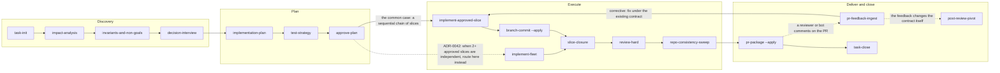

# Workflow demo: one feature, start to finish

This document shows the workflow working, end to end, on a single feature request. [`README.md`](./README.md) explains what Fhorja is and why it exists. This file exists to show it running. Normative rules and the exact command contracts live in [`WORKFLOW_OPERATING_SYSTEM.md`](./WORKFLOW_OPERATING_SYSTEM.md) and in each file under [`commands/`](./commands/). For one-line copy-paste starters per command, use [`COMMAND_PROMPT_STUBS.md`](./COMMAND_PROMPT_STUBS.md) instead.

**This walkthrough is entirely synthetic.** The project, the task, the file names, the schema, and every example output below were invented for this document. Nothing here is copied from a real product, client, or codebase.

## The feature, in one paragraph

You maintain a small invoicing app (Next.js, Supabase for auth and data). A customer asks for a CSV export button on the invoices list, so they can pull the currently filtered invoices into a spreadsheet. It sounds small. It touches a tenant-scoped database table through row-level security, needs a decision about what happens when someone tries to export ten thousand rows, and ends with a PR round and a real reviewer comment. That is enough shape to walk the full lifecycle once, including two of the workflow's opt-in commands that most demos skip.

## Before the first command

A few things are worth knowing before you read turn one:

- Every command ends the same way: an `### Artifact changes` block, a short `### Command transcript`, and a `### Handoff` that names the next command, the editor mode, and why. That shape repeats below for every turn. Once you have seen it twice, you can skim the rest.
- Every command writes its task files as it runs and marks them `APPLIED`, in every editor mode (ADR-0199, ADR-0215). The one place you will see `PROPOSED` is a block a command stages inside a section another command owns, for that owner to promote (ADR-0034). Turn 2 shows one.
- This walkthrough follows one shape among several. The [Other task shapes](#other-task-shapes) section below points to the others: small tasks, docs-only tasks, refactors, and incident response, each with its own route through the chain.
- The task runs under the `strict` [operating mode](#operating-modes), because the export reads a tenant-scoped table. Turn 1 shows `task-init` adding the strict-surface commands on its own; the mode line in the request only declares what `task-init` would have suggested.
- **One command per turn is how this document is written, not how a session runs.** Each turn below shows what a command receives and what it emits, side by side, because that is the clearest way to learn the shape. A real attended session does not work that way: the `Run now:` line at the end of each turn is what the session does NEXT, by itself, without you typing the `Run @commands/...` line that opens the following turn. Read those lines as "this is what the next command received", not as "this is what you must send". A chained session also emits ONE `### Handoff` for the whole turn rather than one per command (ADR-0192), so the per-command record you see repeated below lives in the task folder on disk. What still needs you is the small set of stops each command names, marking the draft PR ready for review, and the merge.

## The command chain

The default chain is five commands: `task-init -> implementation-plan -> approve-plan -> implement-approved-slice -> branch-commit --apply` (ADR-0184, ADR-0208). A command joins it only when `task-init` can name the disqualifier that adds it, and a one-sentence change to at most two named files skips `implementation-plan` and `approve-plan` on the one-slice route (ADR-0225). This task trips three: the scope needs more than one sentence to state (adds `impact-analysis`), the row cap is a decision the request does not contain (adds `decision-interview`), and the surface is multi-tenant isolation (adds `invariants-and-non-goals`, `test-strategy` and `review-hard`). The diagram shows this task's chain with those additions.


```mermaid
flowchart LR
  subgraph discover ["Discovery"]
    taskInit["task-init"]
    impact["impact-analysis"]
    invariants["invariants-and-non-goals"]
    decide["decision-interview"]
  end
  subgraph plan ["Plan"]
    planCmd["implementation-plan"]
    testStrat["test-strategy"]
    approve["approve-plan"]
  end
  subgraph run ["Execute"]
    impl["implement-approved-slice"]
    fleetCmd["implement-fleet"]
    commit["branch-commit --apply"]
    closeSlice["slice-closure"]
    review["review-hard"]
    sweep["repo-consistency-sweep"]
  end
  subgraph ship ["Deliver and close"]
    pkg["pr-package --apply"]
    feedback["pr-feedback-ingest"]
    pivot["post-review-pivot"]
    taskClose["task-close"]
  end

  taskInit --> impact --> invariants --> decide --> planCmd --> testStrat --> approve
  approve -->|"the common case: a sequential chain of slices"| impl
  approve -.->|"ADR-0042: when 2+ approved slices are independent, route here instead"| fleetCmd
  fleetCmd --> closeSlice
  impl --> commit --> closeSlice --> review --> sweep --> pkg --> taskClose
  pkg -.->|"a reviewer or bot comments on the PR"| feedback
  feedback -->|"corrective: fix under the existing contract"| impl
  feedback -.->|"the feedback changes the contract itself"| pivot
```

Two branches in this diagram are worth naming, since a diagram alone will not explain them:

- **`approve-plan` chooses between two execution commands.** Most tasks, including this one, are a sequential chain of slices, so `approve-plan` routes to `implement-approved-slice`. When the plan's execution waves show two or more independent slices ready at once (ADR-0042), it routes to `implement-fleet` instead, which runs them in parallel worktrees. This walkthrough never hits that branch: its two slices depend on each other, so there is only ever one slice ready at a time.
- **`pr-feedback-ingest` chooses between two outcomes.** A corrective comment (a bug, a missing test, a style nit) routes back to `implement-approved-slice`. A comment that asks for a different contract or product direction routes to `post-review-pivot` instead, which is a bigger conversation than a quick fix. Turn 12 below shows the corrective path. The paragraph right after it shows what the other branch would have looked like.

Four more commands are not in the diagram because they are opt-in: you reach for them only when the task actually needs them, and skipping them is never wrong. This walkthrough uses all four, so you can see what each looks like in practice rather than just its one-line description.

| Command | Why it shows up here | Where |
|---|---|---|
| `db-context-supabase` | The export has to respect an existing row-level security policy; better to read the real schema than assume it. | After impact-analysis |
| `capture-references` | The export needs a CSV library; the streaming API is worth grounding in its real docs before deciding the row-cap policy. | Before decision-interview |
| `capture-observation` | A small thing worth remembering surfaces mid-implementation, but it is not a decision and does not need a full state sync. | During slice 1 |
| `direction-adjust` | A small course correction gets realized mid-implementation: the export button needs a disabled state. | During slice 2 |

Two more commands sit outside that table for a different reason: a closure floor asks for them. Slice 01 touches an HTTP route handler and Slice 02 touches a servable frontend component, in a project whose `package.json` declares a web build script. The backend-runtime-gate and web-runtime-gate floors (ADR-0127) fire on exactly that shape and ask for a real `api-runtime-verify` and `web-runtime-verify` PASS. The floors record rather than block (ADR-0203): a slice closed without its PASS carries `unverified: no api-runtime-verify PASS` (or the web equivalent) in its closing notes, and `task-close` lists it under `### Unverified floors`. Running the verify is how that list stays empty. Turns 6 through 9 below show both.

## The task folder

Everything below lives under:

`projects/acme__invoicer/active/2026-07-08_csv-export-for-invoices/`

`task-init` creates the five required files. Optional files (`IMPACT_ANALYSIS.md`, `DB_CONTEXT.md`, `INVARIANTS_AND_NON_GOALS.md`, `TEST_STRATEGY.md`, `SLICES/`) appear as the commands that produce them run.

---

## Turn 1: start the task (`task-init`)

The objective is specific enough to skip `problem-framing` (that command exists for fuzzy or possibly mis-scoped objectives; "add a CSV export button" is not one). It is not small enough for the default chain, and `task-init` says why rather than leaving it to judgment.

### What you send

```text
Run @commands/task-init.md.
Project folder: acme__invoicer
Task slug: csv-export-for-invoices
One-line goal: Add a CSV export button to the invoices list that downloads the currently filtered invoices.
Product repo: ~/code/invoicer (Next.js + Supabase)
Operating mode: strict
```

### What you get back (abbreviated)

```markdown
### Artifact changes
- `projects/acme__invoicer/active/2026-07-08_csv-export-for-invoices/README.md`: `APPLIED` (created)
- `.../TASK_STATE.md`: `APPLIED` (created; phase: discovery; Requested deliverables: "CSV export button on invoices list" [in-scope], "Export respects tenant row-level security" [in-scope]; Recommended pipeline with the escalations below; Resume notes: `Operating mode: strict`)
- `.../SOURCE_OF_TRUTH.md`: `APPLIED` (created)
- `.../DECISIONS.md`: `APPLIED` (created, empty)
- `.../IMPLEMENTATION_PLAN.md`: `APPLIED` (skeleton)

### Command transcript
- Initialized the task folder and the five required files.
- Seeded `## Requested deliverables` with the two things the user named.
- Escalations: `impact-analysis` (the scope needs more than one sentence: a tenant-scoped export route and a toolbar button); `decision-interview` (the row cap for a large export is a decision the request does not contain); `invariants-and-non-goals`, `test-strategy` and `review-hard` (multi-tenant isolation surface, which suggests `Operating mode: strict`; declared in the request).

### Handoff
Run now: /impact-analysis
Mode: Ask
Work complexity: LOW
Reason: Three disqualifiers fired; impact-analysis comes first to confirm the touch surfaces.
```

The `## Recommended pipeline` section `task-init` wrote into `TASK_STATE.md`:

```text
## Recommended pipeline
- Escalations: impact-analysis (scope > 1 sentence), decision-interview (row-cap decision not in the request), invariants-and-non-goals, test-strategy and review-hard (multi-tenant isolation)
- task-init -> impact-analysis -> invariants-and-non-goals -> decision-interview -> implementation-plan -> test-strategy -> approve-plan -> per slice: implement-approved-slice, branch-commit --apply, slice-closure -> review-hard -> pr-package
```

Without the tenant-scoped table this task would still take `impact-analysis` and `decision-interview`, but not the strict three. Leave the `Operating mode:` line out of the request and `task-init` still adds those three commands and suggests `strict`; the suggestion alone does not declare the mode ([`wos/operating-modes.md`](./wos/operating-modes.md)).

---

## Turn 2: bounded understanding (`impact-analysis`)

### What you send

```text
Run @commands/impact-analysis.md for the same task folder.
```

### What you get back (abbreviated)

```markdown
### Artifact changes
- `IMPACT_ANALYSIS.md`: `APPLIED` (created)
- `TASK_STATE.md`: `APPLIED` (Active files in scope, Risks to watch)
- `IMPLEMENTATION_PLAN.md`: one `<!-- PROPOSED by impact-analysis -->` block in `## Current gaps` (implementation-plan owns that section and promotes the block when it runs, ADR-0034)

### Command transcript
- Touch surfaces: the invoices list page, a new export API route, the `public.invoices` table (tenant-scoped via RLS).
- Risk flagged: the export query must carry the same tenant predicate as the list view, or a customer could download another tenant's invoices.
- Risk flagged: an unbounded export on a large filtered set could be slow or memory-heavy.

### Handoff
Run now: /db-context-supabase
Mode: Ask
Work complexity: LOW
Reason: The RLS risk is concrete enough to verify against the real schema before deciding anything.
```

---

### Aside: verify the real schema (`db-context-supabase`, opt-in)

This is an opt-in command, so it gets a lighter example than a full turn: one request, one focused answer, no ceremony beyond what it needs.

**What you send:**

```text
Run @commands/db-context-supabase.md for the same task folder.
Scope: public.invoices
Depth: tables+rls
```

**What you get back (abbreviated):**

```markdown
### Artifact changes
- `DB_CONTEXT.md`: `APPLIED` (created)
- `SOURCE_OF_TRUTH.md`: `APPLIED` (appended `## DB context` pointer)

### Command transcript
- MCP precondition check: Supabase MCP reachable.
- Introspected `public.invoices`: 9 columns, RLS enabled, one policy.

### Handoff
Run now: /invariants-and-non-goals
Mode: Ask
Work complexity: LOW
Reason: The tenant boundary is now a verified fact; lock it as an invariant before any decision builds on it.
```

The relevant excerpt from `DB_CONTEXT.md`:

```text
### public.invoices
- Columns: id uuid [PK], tenant_id uuid [NOT NULL], customer_name text, amount_cents integer, currency text, status text, issued_at timestamptz, due_at timestamptz
- RLS enabled: yes
- RLS policies:
  - tenant_isolation [ALL] FOR authenticated: USING (tenant_id = (auth.jwt() ->> 'tenant_id')::uuid)
```

This one fact (`tenant_isolation` filters on `tenant_id`) is what `implementation-plan` and `implement-approved-slice` build against later instead of assuming the export query is safe.

---

### Aside: lock the boundaries (`invariants-and-non-goals`, strict surface)

Not opt-in here: `task-init` added it in Turn 1 because the surface is multi-tenant isolation, and `approve-plan` reviews the plan against this file in Turn 5.

**What you send:**

```text
Run @commands/invariants-and-non-goals.md for the same task folder.
```

**What you get back (abbreviated):**

```markdown
### Artifact changes
- `INVARIANTS_AND_NON_GOALS.md`: `APPLIED` (created)
- `TASK_STATE.md`: `APPLIED` (Constraints / things that must not change)
- `IMPLEMENTATION_PLAN.md`: `APPLIED` (`## Constraints`)

### Command transcript
- Invariant I-1: every exported row belongs to the requesting session's tenant; the `tenant_isolation` policy from DB_CONTEXT.md applies unchanged.
- Invariant I-2: no service-role client on the export path.
- Non-goals: background export jobs, formats other than CSV.

### Handoff
Run now: /capture-references
Mode: Ask
Work complexity: LOW
Reason: Boundaries are locked; ground the CSV library before the row-cap decision.
```

---

### Aside: ground the CSV library (`capture-references`, opt-in)

**What you send:**

```text
Run @commands/capture-references.md.
Project: acme__invoicer
Inputs: https://example.com/docs/csv-stream-lite/streaming-api
Tags: csv-export
```

**What you get back (abbreviated):**

```markdown
### Artifact changes
- `REFERENCES.md`: `APPLIED` (new entry under `## csv-export`)

### Command transcript
- Fetched and summarized 1 source; 0 duplicates.

### Handoff
Run now: /decision-interview
Mode: Ask
Work complexity: MEDIUM
Reason: The library's streaming behavior is now grounded; the row-cap and format decisions can be made against real capability instead of a guess.
```

The entry appended to `REFERENCES.md`:

```text
## csv-export
### csv-stream-lite streaming API
- URL: https://example.com/docs/csv-stream-lite/streaming-api
- Accessed: 2026-07-08
- Summary: csv-stream-lite exposes a Node stream transform that writes rows incrementally rather than building the whole CSV in memory; it caps at roughly 50,000 rows/second on a single core before backpressure matters.
- Context within project: first reference in this project.
- Key points:
  - "createCsvStream returns a standard Node Transform stream; pipe database rows into it and pipe its output to any writable, including an HTTP response."
- Implementation contract:
  - Signature: `createCsvStream(columns: string[]): Transform`
  - Example: `dbRows.pipe(createCsvStream(['id', 'customer_name', 'amount_cents'])).pipe(res)`
  - Version: 3.x
- Tags: csv-export
- Consumes-by: implementation-plan
```

---

## Turn 3: lock the decisions (`decision-interview`)

### What you send

```text
Run @commands/decision-interview.md for the same task folder.
Open questions: row cap for a synchronous export, CSV format details, filename convention.
```

### What you get back (abbreviated)

```markdown
### Artifact changes
- `DECISIONS.md`: `APPLIED` (three new entries)
- `TASK_STATE.md`: `APPLIED` (Canonical decisions)

### Command transcript
- Asked three targeted questions; user answered all three.
- No conflict with I-1 or I-2 in INVARIANTS_AND_NON_GOALS.md.
- Strict mode: each decision carries an unwind note.

### Handoff
Run now: /implementation-plan
Mode: Plan
Work complexity: MEDIUM
Reason: Decisions are locked; boundaries are clear enough to slice safely.
```

The three entries added to `DECISIONS.md`:

```text
D-1: Row cap for synchronous export
Exports above 5,000 filtered rows are rejected with a message asking the user to narrow the filter. No background job in this pass; YAGNI until a real customer hits the cap.
Unwind: raise or remove the cap in one constant; no data changes.

D-2: CSV format
Comma-delimited, UTF-8 with a BOM (so Excel opens it without a mangled first column), one header row matching the visible list columns.
Unwind: the format lives in one builder function; files already downloaded are unaffected.

D-3: Filename convention
`invoices-<tenant-slug>-<YYYY-MM-DD>.csv`, generated at request time.
Unwind: rename at request time; nothing stores the name.
```

---

## Turn 4: plan the slices (`implementation-plan`)

### What you send

```text
Run @commands/implementation-plan.md for the same task folder.
```

### What you get back (abbreviated)

```markdown
### Artifact changes
- `IMPLEMENTATION_PLAN.md`: `APPLIED` (2 slices + Execution waves; promoted the impact-analysis block in `## Current gaps`)
- `TASK_STATE.md`: `APPLIED` (phase -> planning)

### Command transcript
- Sliced into an API-side export and a UI-side button, in that order (the button needs a real endpoint to call).
- Execution waves: Wave 1 [Slice 01]; Wave 2 [Slice 02]. A pure chain, not a fan-out.

### Handoff
Run now: /test-strategy
Mode: Plan
Work complexity: LOW
Reason: Strict mode: test-strategy is the next missing step before approve-plan (ADR-0162).
```

The two slices, abbreviated:

```text
### Slice 01: CSV export API route
Scope: app/api/invoices/export/route.ts, lib/csv/build-invoice-export.ts
Depends-on: none
Decision-ref: D-1, D-2, D-3
Work complexity: MEDIUM (touches the RLS-scoped query and a new dependency)
Exit criteria: WHEN a request is made with an authenticated tenant session and a filter under 5,000 rows the API SHALL stream back a CSV matching D-2 and D-3, scoped to that tenant's invoices only (I-1), through the tenant-scoped client with no service-role bypass (I-2).

### Slice 02: Export button on the invoices list
Scope: app/invoices/InvoiceListToolbar.tsx
Depends-on: Slice 01
Decision-ref: D-1
Work complexity: LOW (UI wiring against an already-tested endpoint)
Exit criteria: WHEN the user clicks "Export CSV" on a filtered list the UI SHALL call the Slice 01 endpoint with the active filters and trigger a file download, or SHALL show the row-cap message when the API rejects the request.

## Execution waves
Wave 1: [01]
Wave 2: [02]
```

---

### Aside: pick the tests that matter (`test-strategy`, strict surface)

**What you send:**

```text
Run @commands/test-strategy.md for the same task folder.
```

**What you get back (abbreviated):**

```markdown
### Artifact changes
- `TEST_STRATEGY.md`: `APPLIED` (created)
- `IMPLEMENTATION_PLAN.md`: `APPLIED` (`## Validation expectations`)

### Command transcript
- Stack read from package.json: Vitest for the route and the CSV builder (already a dev dependency), React Testing Library for the toolbar.
- Critical: a second tenant's session gets only its own rows (I-1). Regression: the 5,001st row is rejected before streaming starts (D-1).

### Handoff
Run now: /approve-plan
Mode: Agent
Work complexity: LOW
Reason: Plan, invariants and test strategy are on disk; lock the baseline before execution begins.
```

---

## Turn 5: lock the baseline (`approve-plan`)

### What you send

```text
Run @commands/approve-plan.md for the same task folder.
```

### What you get back (abbreviated)

```markdown
### Artifact changes
- `IMPLEMENTATION_PLAN.md`: `APPLIED` (`## Approval log`: APPROVED)
- `TASK_STATE.md`: `APPLIED` (approval stamp; recommended next step: Slice 01)
- `projects/acme__invoicer/OUTCOMES.jsonl`: `APPLIED` (two `plan_review` lines, one per pass)

### Command transcript
- Cross-checked slices against DECISIONS.md and INVARIANTS_AND_NON_GOALS.md: no gap.
- Blinded review, pass 1 (one `verify-against-rubric` pass carrying the plan path and the locked-decisions rubric, nothing else): RESOLVED, every slice traces to a locked decision.
- Blinded review, pass 2 (multi-tenant isolation is a strict surface, so a second pass runs against INVARIANTS_AND_NON_GOALS.md as its rubric): RESOLVED, Slice 01 carries I-1 and I-2 in its exit criteria and no slice reaches a non-goal.
- No human turn; ESCALATED is the only exit that would have reached you (ADR-0208).
- Execution waves are a pure chain (max wave size 1), so routing goes to implement-approved-slice, not implement-fleet.

### Handoff
Run now: /implement-approved-slice
Mode: Agent
Work complexity: MEDIUM
Reason: Slice 01 touches the RLS-scoped query; correctness here matters more than speed.
```

---

## Turn 6: execute slice 01 (`implement-approved-slice`)

### What you send

```text
Run @commands/implement-approved-slice.md for the same task folder.
Approved slice only: Slice 01 (CSV export API route).
```

### What you get back (abbreviated)

```markdown
### Artifact changes
- (Product repo) `app/api/invoices/export/route.ts`: `APPLIED` (created)
- (Product repo) `lib/csv/build-invoice-export.ts`: `APPLIED` (created)
- `TASK_STATE.md`: `APPLIED` (Slice 01 marked implemented, evidence linked)

### Command transcript
- Grounded in: REFERENCES.md `csv-stream-lite streaming API` entry (the streaming Transform signature).
- Query reuses the existing tenant-scoped Supabase client, so the `tenant_isolation` RLS policy from DB_CONTEXT.md applies unchanged; no service-role bypass added (I-2).
- Ran the route against a local seed with 3 tenants; each request returned only its own tenant's rows.
- Row-cap (D-1) enforced with a 5,001st-row check before streaming starts, so a large export fails fast instead of after downloading most of it.
- The critical and regression tests from TEST_STRATEGY.md pass.

### Handoff
Run now: /api-runtime-verify
Mode: Agent
Work complexity: LOW
Reason: Slice 01 touched an HTTP route handler; the backend-runtime-gate floor (ADR-0127) asks for a real PASS.
```

---

### Aside: something worth remembering (`capture-observation`, opt-in)

While building the export route, you notice something not urgent enough to act on now, but worth not losing.

**What you send:**

```text
Run @commands/capture-observation.md for the same task folder.
Observation: date columns (issued_at, due_at) export in UTC; if a customer's spreadsheet app localizes them, invoice dates could look off by a day near midnight. Not in scope for this task; worth a follow-up if it comes up.
Tag: concern
```

**What you get back (abbreviated):**

```markdown
### Artifact changes
- `TASK_STATE.md`: `APPLIED` (one line appended to `## Observations`)

### Command transcript
- Appended verbatim; no other section touched.

### Handoff
Run now: /api-runtime-verify
Mode: Ask
Work complexity: LOW
Reason: Resume the runtime-gate verification that was in progress before this capture.
```

The line added to `TASK_STATE.md`:

```text
## Observations
- [2026-07-08] [concern] date columns export in UTC; a customer's spreadsheet app localizing them could show invoice dates off by a day near midnight. Out of scope for this task.
```

---

### Aside: verify the route at runtime (`api-runtime-verify`, floor-required)

Slice 01 touched an HTTP route handler, so the backend-runtime-gate floor (ADR-0127) asks for a real `api-runtime-verify` PASS. Without one, `slice-closure` still closes the slice and records `unverified: no api-runtime-verify PASS` in its closing notes (ADR-0203). On a tenant-scoped route that is a debt worth not taking: this run is the only runtime evidence that the isolation holds.

**What you send:**

```text
Run @commands/api-runtime-verify.md for the same task folder.
Slice: 01 (CSV export API route)
Base URL: http://localhost:3000, started via `next dev`
Routes: GET /api/invoices/export (authenticated, tenant-scoped)
```

**What you get back (abbreviated):**

```markdown
### Artifact changes
- `API_RUNTIME_VERIFY.md`: `APPLIED` (created)
- `TASK_STATE.md`: `APPLIED` (one line: backend-runtime-gate floor PASS)

### Command transcript
- Probed GET /api/invoices/export as an authenticated tenant session under the 5,000-row cap: 200, `text/csv`, streamed body matches D-2 and D-3.
- Probed the same route with a second tenant's session: 200, but every returned row carries only that tenant's own `tenant_id` (AUTH_BOUNDARY: clean).
- Probed a filter that resolves to 5,200 rows: 413 with the D-1 message, no partial file started.
- No UNREACHABLE, STATUS_MISMATCH, CONTENT_TYPE_MISMATCH, SHAPE_MISMATCH, AUTH_BOUNDARY, ERROR_LEAK, or EFFECT_NOT_OBSERVED findings.

### Gate decision
PASS. Every route in scope was reached and every acceptance behavior is `observed`.

### Handoff
Run now: /branch-commit --apply
Mode: Agent
Work complexity: LOW
Reason: Gate PASS. The commit-evidence floor needs Slice 01 committed before slice-closure can close it.
```

---

### Aside: commit the slice (`branch-commit --apply`, commit-evidence floor)

`slice-closure` refuses to close a slice with no commit behind it, so each slice is committed before its closure. `--apply` shows the staged content first and then creates the local commit in the same turn. A local commit reaches nobody outside this checkout, so it needs no second confirmation (ADR-0163, ADR-0200).

**What you get back (abbreviated):**

```markdown
### Artifact changes
- Commit a1b2c3d on `task/csv-export-for-invoices` (HEAD before: 7e0d4c1; tree shown and tree committed: 5b9e2f0, equal)

### Command transcript
- Branch read from `git branch --show-current`: `task/csv-export-for-invoices`, not the default branch.
- Displayed the commit message, `git status --porcelain`, and the full staged diff before committing (two new files, both staged).
- Commit message: `feat(invoices): add tenant-scoped CSV export route`.

### Handoff
Run now: /slice-closure
Mode: Ask
Work complexity: LOW
Reason: Slice 01 has its commit; ready for a closure judgment.
```

---

## Turn 7: close slice 01 (`slice-closure`)

Imagine a day passes here, and tomorrow's work opens in a new chat. The Handoff below is still **Mode A**. Mode B, the form with a `Resume context:` block, is for context that was actually lost: after auto-compaction, or when the next command is `resume-from-state`. A new chat needs no pasted summary, because `resume-from-state` reads it back from `TASK_STATE.md`.

### What you send

```text
Run @commands/slice-closure.md for the same task folder.
```

### What you get back (abbreviated)

```markdown
### Artifact changes
- `TASK_STATE.md`: `APPLIED` (Last completed step, In progress, Recommended next step, Current closure target)

### Command transcript
- Exit criteria for Slice 01 verified against the recorded test run; all met.
- Backend-runtime-gate floor (ADR-0127): `api-runtime-verify` PASS cited (`API_RUNTIME_VERIFY.md`).
- Commit-evidence floor (ADR-0084, ADR-0100): commit a1b2c3d cited on `task/csv-export-for-invoices`; classified ready to close.

### Deliverable status (per ADR-0056)
- "Export respects tenant row-level security": done (Slice 01 evidence above).
- "CSV export button on invoices list": in-scope, not yet started (Slice 02).

### Handoff
Run now: /implement-approved-slice
Mode: Agent
Work complexity: LOW
Reason: Slice 02 is UI wiring against an already-verified endpoint.
```

---

## Turn 8: execute slice 02 (`implement-approved-slice`)

### What you send (new session)

```text
Run @commands/resume-from-state.md for projects/acme__invoicer/active/2026-07-08_csv-export-for-invoices/.
```

`resume-from-state` reads `TASK_STATE.md`, finds Slice 02 as the recommended next step, and continues into `implement-approved-slice` in the same turn. What comes back is that command's output.

### What you get back (abbreviated)

```markdown
### Artifact changes
- (Product repo) `app/invoices/InvoiceListToolbar.tsx`: `APPLIED` (button added)
- `TASK_STATE.md`: `APPLIED` (Slice 02 marked implemented)

### Command transcript
- Wired the button to the Slice 01 endpoint with the active filter state.
- On the 5,000-row rejection, the UI now shows D-1's message inline instead of a generic error.

### Handoff
Run now: /web-runtime-verify
Mode: Agent
Work complexity: LOW
Reason: Slice 02 touched a servable frontend component; the web-runtime-gate floor (ADR-0127) asks for a real PASS.
```

---

### Aside: a small correction mid-slice (`direction-adjust`, opt-in)

While testing the button by hand, you notice a real gap: nothing stops a double-click from firing two export requests. This is small enough to fold into the current slice, not big enough to reopen `decision-interview`.

**What you send:**

```text
Run @commands/direction-adjust.md for the same task folder.
Realization: double-clicking "Export CSV" fires two overlapping requests. The button should disable and show a spinner while a request is in flight.
```

**What you get back (abbreviated):**

```markdown
### Artifact changes
- `DECISIONS.md`: `APPLIED` (D-4)
- `TASK_STATE.md`: `APPLIED` (Recommended next step unchanged: still implement-approved-slice, same slice)

### Command transcript
- Validated against D-1 through D-3 and against I-1 and I-2 in INVARIANTS_AND_NON_GOALS.md: compatible, no conflict.
- Small enough for Slice 02 to absorb without re-planning.

### Handoff
Run now: /implement-approved-slice
Mode: Agent
Work complexity: LOW
Reason: The fix is a bounded addition to the slice already in progress.
```

The entry added to `DECISIONS.md`:

```text
D-4: mid-task adjustment, disable the export button while a request is in flight
Before: the button had no loading state. Now: it disables and shows a spinner from click until the response resolves, to prevent duplicate downloads on a double-click. Trigger: observed during manual testing of Slice 02.
Unwind: remove the loading state; no data effect.
```

Slice 02 is then re-run with the same command shown above. The abbreviated output looks the same shape, with one more line in `### Command transcript`: "Added disabled and loading state per D-4."

---

### Aside: verify the button at runtime (`web-runtime-verify`, floor-required)

Slice 02 touched a servable frontend component in a project with `next build` and `next dev` scripts, so the web-runtime-gate floor (ADR-0127) asks for a real `web-runtime-verify` PASS. As with Slice 01, a closure without it would record `unverified: no web-runtime-verify PASS` rather than stop.

**What you send:**

```text
Run @commands/web-runtime-verify.md for the same task folder.
Slice: 02 (Export button on the invoices list)
Build: `next build` then `next start`, served on an ephemeral port
Page: /invoices
```

**What you get back (abbreviated):**

```markdown
### Artifact changes
- `WEB_RUNTIME_VERIFY.md`: `APPLIED` (created)
- `TASK_STATE.md`: `APPLIED` (one line: web-runtime-gate floor PASS)

### Command transcript
- Served the build on an ephemeral port; page identity confirmed against `/invoices` before any other check.
- Clicked "Export CSV" on a filtered list: button disabled and showed a spinner (D-4) until the download started; no double request fired on a rapid double-click.
- Clicked "Export CSV" against a filter over the 5,000-row cap: the D-1 message rendered inline, no console error.
- Overflow sweep at 320 to 2560 px: clean. Console capture: zero errors or warnings.

### Gate decision
PASS. Every acceptance behavior is `observed`.

### Handoff
Run now: /branch-commit --apply
Mode: Agent
Work complexity: LOW
Reason: Gate PASS. The commit-evidence floor needs Slice 02 committed before slice-closure can close it.
```

`branch-commit --apply` commits Slice 02 the same way it committed Slice 01 (commit e4f5a6b). The output has the same shape, so it is not repeated.

---

## Turn 9: close slice 02 (`slice-closure`)

### What you send

```text
Run @commands/slice-closure.md for the same task folder.
```

### What you get back (abbreviated)

```markdown
### Artifact changes
- `TASK_STATE.md`: `APPLIED` (closure fields; Current closure target -> whole task)

### Command transcript
- Both slices verified against recorded exit-criteria evidence.
- Web-runtime-gate floor (ADR-0127): `web-runtime-verify` PASS cited (`WEB_RUNTIME_VERIFY.md`).
- Commit-evidence floor (ADR-0084, ADR-0100): commit e4f5a6b cited on `task/csv-export-for-invoices`.

### Deliverable status (per ADR-0056)
- "Export respects tenant row-level security": done.
- "CSV export button on invoices list": done.

### Handoff
Run now: /review-hard
Mode: Ask
Work complexity: MEDIUM
Reason: Both slices are closed; strict mode requires a review-hard pass before packaging.
```

---

## Turn 10: risk review (`review-hard`)

### What you send

```text
Run @commands/review-hard.md for the same task folder.
```

### What you get back (abbreviated)

```markdown
### Artifact changes
- `TASK_STATE.md`: `APPLIED` (review verdict noted under Risks to watch)

### Command transcript
- Reviewed both slices against the real diff, not just the plan.

### Must-fix issues
- None.

### Should-fix issues
- `build-invoice-export.ts`: the row-cap check re-queries `count(*)` before streaming; consider a single query with a `LIMIT 5001` instead, to avoid a second round trip. (impact LOW, effort S)

### Deliverable reconcile (per ADR-0056)
- Both requested deliverables are done; nothing unreconciled.

### Handoff
Run now: /repo-consistency-sweep
Mode: Ask
Work complexity: LOW
Reason: One should-fix item is cheap; a proactive sweep is worth running before packaging.
```

---

### Aside: proactive defect sweep (`repo-consistency-sweep`)

Not opt-in in the sense of the four commands above, but light enough here to show in abbreviated form rather than a full turn.

```markdown
### Artifact changes
- `TASK_STATE.md`: `APPLIED` (`## Latest sweep` pointer to the sweep result)

### Command transcript
- Diff touches 3 files; 4 bug-class templates matched by file pattern.

### Findings
- P2: `route.ts` returns a generic 500 on an unexpected Supabase error instead of a typed error shape used elsewhere in `app/api/`. (confidence MEDIUM, effort S)

### Handoff
Run now: /pr-package
Mode: Ask
Work complexity: LOW
Reason: No P0 or P1 findings; the two should-fix items are cheap enough to note as reviewer attention points rather than blocking packaging.
```

The should-fix from `review-hard` and the P2 from the sweep both get folded in as a quick follow-up (`implement-slice-complement`, committed with `branch-commit --apply`; not shown in full here since it repeats the same three-block shape as Turn 8) before packaging.

---

## Turn 11: package the PR (`pr-package --apply`)

### What you send

```text
Run @commands/pr-package.md --apply for the same task folder.
Product repo: ~/code/invoicer
Git base branch for diff: main
PR title: Add CSV export for filtered invoices
```

### What you get back (abbreviated)

```markdown
### Artifact changes
- `PR_PACKAGE.md`: `APPLIED` (full package)
- Pushed `task/csv-export-for-invoices` to `origin`; opened draft PR #128

### Command transcript
- Diff computed vs `main`: 4 files changed, 187 insertions.
- Displayed before acting: the remote `origin` with its URL, the branch, the base, the PR title and the full PR body.
- Read `.github/workflows/`: no workflow triggered on `pull_request: opened` reaches anyone outside the repository, so the draft opens on the `--apply` authorization alone (ADR-0185, ADR-0200).

### Handoff
Run now: /pr-feedback-ingest
Mode: Ask
Work complexity: N/A
Reason: Stopping here: marking the draft ready for review notifies reviewers, an audience that is not bounded. That step and the merge are yours; run this once review comments land.
```

The relevant excerpt from `PR_PACKAGE.md`:

```text
Branch: task/csv-export-for-invoices
Commit: feat(invoices): add CSV export for filtered invoices

PR title: Add CSV export for filtered invoices
PR body:
Adds a CSV export button to the invoices list. Exports respect the existing
tenant row-level security policy and cap at 5,000 rows per D-1; larger
filtered sets show a message asking the user to narrow the filter first.

Reviewer attention points:
- lib/csv/build-invoice-export.ts: confirm the row-cap check reads clearly (a review-hard should-fix suggested a single-query alternative; applied).
```

---

## Turn 12: PR feedback (`pr-feedback-ingest`)

You mark the draft ready for review. A teammate reviews it and leaves two comments.

### What you send

```text
Run @commands/pr-feedback-ingest.md for the same task folder.
PR: https://example.com/acme/invoicer/pull/128
Feedback (paste):
[human] The filename should include the filter description, not just the date, so two exports from the same day don't look identical in Downloads.
[human] Nit: build-invoice-export.ts imports csv-stream-lite with a default import; the package docs show a named import.
```

### What you get back (abbreviated)

```markdown
### Artifact changes

**Feedback matrix**

| id | source | summary | severity | in_scope | target | next_action |
|----|--------|---------|----------|----------|--------|-------------|
| F1 | human | filename should reflect the active filter, not just the date | should-fix | yes | app/api/invoices/export/route.ts | fix |
| F2 | human | wrong import style for csv-stream-lite | nit | yes | lib/csv/build-invoice-export.ts | fix |

- `TASK_STATE.md`: `APPLIED` (both items noted as pending micro-deltas)

### Command transcript
- Both items are corrective under the existing contract; neither reopens D-1 through D-4.

### Handoff
Run now: /implement-slice-complement
Mode: Agent
Work complexity: LOW
Reason: Two small, well-scoped corrections mapped to known files.
```

**If, instead, the comment had been** "actually, let's make this a background job with an email link instead of a synchronous download," the feedback matrix would tag it `question`, mark it `in_scope: no` against D-1, and the Handoff would route to `post-review-pivot` instead of `implement-slice-complement`, since that changes the contract this task was built against rather than fixing something inside it.

---

## Turn 13: close the task (`task-close`)

After `implement-slice-complement` lands F1 and F2 and the PR merges:

### What you send

```text
Run @commands/task-close.md for the same task folder.
Merge evidence: PR #128 merged into main, commit 9f1c2ab.
```

### What you get back (abbreviated)

```markdown
### Artifact changes
- `TASK_STATE.md`: `APPLIED` (final closed state)
- `projects/acme__invoicer/knowledge/csv-export-for-invoices.md`: `APPLIED` (created)
- `projects/acme__invoicer/knowledge/index.md`: `APPLIED` (linked under By date)
- `projects/acme__invoicer/OUTCOMES.jsonl`: `APPLIED` (one line appended)
- (task folder moved) `active/2026-07-08_csv-export-for-invoices/` -> `archive/2026-07-08_csv-export-for-invoices/`

### Command transcript
- Done-conditions: implementation complete (met), review complete (met, review-hard + sweep), team approval (met, PR review), merge (met, commit 9f1c2ab).
- Platform runtime floors (ADR-0127): web-runtime-gate and backend-runtime-gate both satisfied by the PASSes cited at Slice 01 and Slice 02 closure.
- Test-strategy consumption: the critical and regression rows in TEST_STRATEGY.md each map to a test file.
- Commit-evidence floor (ADR-0084, ADR-0100): satisfied by the merge commit.

### Unverified floors
none

### Deliverable reconcile (per ADR-0056)
- Both requested deliverables are done; nothing unreconciled.

### Handoff
Run now: none
Mode: N/A
Work complexity: N/A
Reason: Task is closed and archived; nothing to run next unless new scope shows up, which would start with task-init.
```

---

## How to use this walkthrough

1. Read [`WORKFLOW_OPERATING_SYSTEM.md`](./WORKFLOW_OPERATING_SYSTEM.md) once for the mode policy and the output contract. Everything above follows it.
2. Pick a starting command from the [command catalog](./docs/command-catalog.html), or a one-liner from [`COMMAND_PROMPT_STUBS.md`](./COMMAND_PROMPT_STUBS.md).
3. Follow each Handoff. In the same attended session you do not paste anything: the model continues into the `Run now:` command in the same turn, and stops only for a reason it names (ADR-0186). In a new session, start with `resume-from-state`, the way Turn 8 does above: it reads `TASK_STATE.md` and continues from the recorded next step.
4. Nothing waits for you to persist it. Each command writes its task files as it runs and lists them in `### Artifact changes`. To correct a file that came out wrong, run the owning command again with the right facts, or run `state-reconcile` when several files disagree.
5. If you lose the thread, run `resume-from-state` (new session) or `what-next` (same session). Both read `TASK_STATE.md` first.

## Optional shortcuts (same contracts)

| Situation | Command |
|-----------|---------|
| Lost the thread mid-task | `resume-from-state` |
| Unsure which command fits | `what-next` (declare `Operating mode: teaching` for phase context and ranked candidates) |
| Several artifacts disagree with each other | `state-reconcile` |
| Small `TASK_STATE.md` catch-up only | `sync-task-state` |
| Review changes the product direction, not just the code | `post-review-pivot` |
| A concrete observed failure: stack trace, failing test, prod alert | `incident-triage` |
| Need to research several external sources before deciding | `external-research` (after `capture-references` per source) |
| Need an outward-facing artifact: exec summary, release note, demo script | `delivery-asset` |

Routing authority stays in `WORKFLOW_OPERATING_SYSTEM.md` under `## Command roles`, with `wos/command-roles.md` holding the full per-command detail.

## Other task shapes

This walkthrough is one shape among several. [`wos/workflow-shapes.md`](./wos/workflow-shapes.md) defines the others (small tasks, docs-only, test-only, refactors, incident response, resuming after an interruption, review pivots), each with the commands it needs and the rule for switching to a different shape. [ADR-0009](./docs/adr/0009-task-shape-system.md) has the reasoning.

## Operating modes

The three operating modes are `minimal`, `strict` and `teaching`, declared at `task-init` and recorded in `TASK_STATE.md` under `## Resume notes`. [`wos/operating-modes.md`](./wos/operating-modes.md) defines each one, and [ADR-0008](./docs/adr/0008-operating-modes.md) has the reasoning. This walkthrough runs `strict`, because the export reads a tenant-scoped table.
